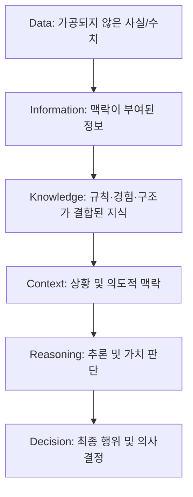
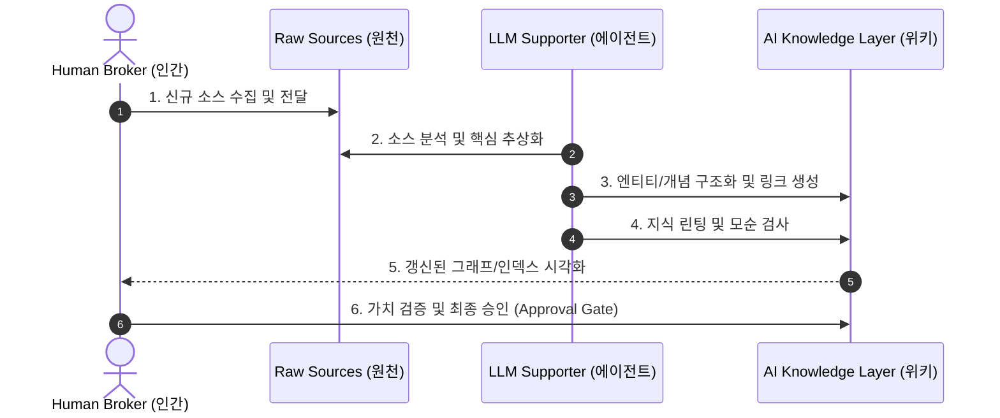

# Human-AI Knowledge Reference Architecture (지식 거버넌스 참조 아키텍처)

> **Document ID**: `0802_human_ai_knowledge_architecture`  
> **Version**: `1.0.0`  
> **Author**: Antigravity AI & Knowledge Architecture Team  
> **Target Audience**: PKM/KM 구축자, AI 에이전트 설계자, 시스템 아키텍트  

---

## 1. Knowledge란 무엇인가 (Ontology & Foundations)

지식 관리 및 AI 에이전트 설계의 출발점은 **데이터(Data)**가 어떻게 **최종 의사결정(Decision)**으로 진화하는지에 대한 온톨로지(Ontology)를 명확히 정의하는 것입니다.



### 1.1 지식 파이프라인 요소 정의
- **Data (데이터)**: 관측된 원시 사실 및 수치 (예: 로그, 센서 수치, 원본 텍스트).
- **Information (정보)**: 의미 있는 맥락(Context)이 부여되어 분류된 데이터.
- **Knowledge (지식)**: 정보에 인간의 경험, 규칙, 관계망, 구조가 결합하여 문제 해결에 직접 사용될 수 있는 자산.
- **Context (맥락)**: 특정 지식이 적용되는 물리적·사회적·의도적 환경 조건.
- **Reasoning (추론)**: 맥락과 지식을 결합하여 결론을 도출하는 논리 및 직관 과정.
- **Decision (의사결정)**: 추론을 바탕으로 실행되는 최종 선택 및 행위.

### 1.2 지식 주체의 이원화 (Human vs AI Knowledge)
본 참조 아키텍처에서는 지식을 생성하고 소유하는 주체 및 형태에 따라 다음과 같이 이원화합니다.

- **Human Knowledge (인간 지식)**: 인간의 경험, 직관, 가치관, 의도(Why) 및 문화적 맥락에서 형성된 지식. 주관적이며 비선형적이고, 목적의식을 포함합니다.
- **AI Knowledge (AI 지식)**: 명시적 데이터, 연관 그래프, LLM에 의해 체계적으로 요약 및 구조화(What/How)된 지식. 객관적·통계적이며 일관성을 유지합니다.

---

## 2. 왜 분리해야 하는가 (Imperatives for Separation)

인간 지식과 AI 지식을 단일 층(Single Layer)으로 혼재시키는 기존 RAG 및 지식 관리 방식은 지식의 오염과 책임의 불투명성을 초래합니다. 두 지식을 엄격히 구분해야 하는 5가지 핵심 이유는 다음과 같습니다.

### 2.1 Authority (권한과 주체성)
의도 및 가치관 설정의 주체는 **인간 중개자(Knowledge Broker)**이며, **AI는 이를 지원하는 조력자(Knowledge Supporter)**입니다. AI 지식이 인간의 권한 영역을 침범하지 않도록 권한 경계를 명확히 해야 합니다.

### 2.2 Provenance (지식의 출처 및 진실성)
어떤 지식이 인간의 경험/의도에서 비롯된 것인지, AI의 확률적 추론에 의해 합성된 것인지 명확히 이력을 추적(Source of Truth)할 수 있어야 시스템 전체의 신뢰도가 유지됩니다.

### 2.3 Lifecycle (지식 생애주기)
인간 지식은 실생활의 경험과 재해석에 따라 업데이트되는 반면, AI 지식은 정합성 린팅(Linting) 및 자동 교차 검증에 따라 관리됩니다. 생애주기와 갱신 메커니즘이 다르므로 관리 계층의 분리가 필수적입니다.

### 2.4 Responsibility (책임 소재)
오판이나 환각(Hallucination)으로 인한 장애 발생 시 책임 소재(Accountability)를 규명하기 위해 지식의 판단 주체를 명확히 구별해야 합니다.

### 2.5 Model Collapse (자기참조적 지식 오염 방지)
AI가 생성한 데이터가 다시 AI의 검증 없는 입력 소스로 재순환될 때 발생하는 **모델 붕괴(Model Collapse)** 및 편향 증폭 현상을 차단하기 위해 원본 인간 지식 레이어를 격리·보호해야 합니다.

---

## 3. Human Knowledge 모델 (Human Model)

### 3.1 5대 핵심 특성
1. **창의적 비선형 사고 (Creative & Non-linear Thinking)**: 논리적 비약과 유연한 도약을 통해 전대미문의 아이디어를 도출합니다.
2. **상황적 유연성 및 적응력 (Situational Adaptability & Flexibility)**: 정형화되지 않은 예외 상황에서 규칙을 수정하고 적응합니다.
3. **문화적·사회적 맥락 공유 (Cultural & Social Context Sharing)**: 언어 너머의 뉘앙스, 관습, 공동체의 묵시적 약속을 이해합니다.
4. **망각과 재해석을 통한 추상화 (Abstraction via Forgetting & Reinterpretation)**: 불필요한 세부 사항을 잊음으로써 고차원의 원칙을 추출합니다.
5. **목적의식 및 자기의도성 (Purposefulness & Self-Intentionality)**: '왜 이 일을 해야 하는가(Why)'에 대한 주체적 의도와 동기를 가집니다.

### 3.2 장점 및 한계
- **장점**: 고차원적 가치 부여, 복잡한 비정형 문제 해결, 의도 중심의 방향 설정.
- **한계**: 인간의 기억 한계(휘발성), 구조화 및 교차 검증 작업의 높은 피로도, 개인 편향 존재.

---

## 4. AI Knowledge 모델 (AI Model)

### 4.1 5대 핵심 특성
1. **명시적 데이터화 및 구조화 (Explicit Datafication & Structuring)**: 비구조적 텍스트를 체계적인 표준 마크다운 및 메타데이터로 변환합니다.
2. **논리적 일관성 및 재현성 (Logical Consistency & Reproducibility)**: 입력 조건에 대해 논리적 오류 없이 일관된 결과를 산출합니다.
3. **지속적 축적 및 상호 연결성 (Continuous Compounding & Interlinkage)**: 대규모 문서 간 교차 참조 및 지식의 복리 축적을 수행합니다.
4. **무한한 연관성 및 그래프 매핑 (Infinite Relation Graph Mapping)**: 방대한 개체(Entity)와 개념 간의 노드/엣지 관계망을 실시간 매핑합니다.
5. **정합성 검증 및 린팅 자동화 (Automated Consistency Auditing & Linting)**: 깨진 링크, 고립 페이지, 모순된 주장을 피로 없이 자동으로 검사합니다.

### 4.2 장점 및 한계
- **장점**: 피로 없는 무제한 유지보수, 초고속 대규모 검색, 완벽한 구조적 정리.
- **한계**: 주체적 의도(Why) 부재, 환각 발생 가능성, 맥락에 대한 깊은 유기적 이해 부족.

---

## 5. 비교 프레임워크 (Comparison Framework)

| 차원 (Dimension) | Human Knowledge (인간 지식) | AI Knowledge (AI 지식) |
| :--- | :--- | :--- |
| **주 역할 (Primary Role)** | 지식 융합 중개자 (Knowledge Broker) | 지식 조력자 (Knowledge Supporter) |
| **핵심 동력 (Core Driver)** | 의도, 가치 판단, 맥락 (Why) | 구조화, 연산, 무결성 (How/What) |
| **사고 방식 (Cognition Pattern)** | 비선형적·창의적 도약 | 선형적·통계적 패턴 추출 |
| **구조화 형태 (Form)** | 암묵지, 비정형 텍스트, 아이디어 | 명시적 마크다운, 메타데이터, 그래프 |
| **유지보수 능력 (Maintenance)** | 피로도가 높아 방치되기 쉬움 | 자동화된 린팅(Linting)으로 피로 없음 |
| **출처 진실성 (Provenance)** | 근본적 원천 (Source of Truth) | 파생된 합성/구조화 자산 |
| **에러 양상 (Error Mode)** | 건망증, 편향, 감정적 오판 | 환각(Hallucination), 맥락 오해 |
| **갱신 주기 (Update Cycle)** | 경험 및 사건 발생 시 불규칙 갱신 | 소수 수집 시 즉시 및 주기적 검사 |
| **확장성 (Scalability)** | 개인의 뇌 용량 한계 존재 | 무제한 스토리지 및 노드 확장 |
| **책임 주체 (Accountability)** | 최종 법적·윤리적 책임 보유 | 책임 불가능 (실행 도구) |

---

## 6. Cross Reference Architecture (상호 참조 아키텍처)

### 6.1 지식 데이터 흐름 (Knowledge Dataflow)


### 6.2 데이터 구조 (Data Schema Protocol)

모든 위키 문서에는 인간 지식과 AI 지식을 구별하기 위한 표준 **YAML Frontmatter** 메타데이터가 포함됩니다.

```yaml
---
id: "concept-2026-0802-001"
title: "Human-AI Knowledge Co-existence"
type: "concept" # source | entity | concept | synthesis
author_type: "human" # human | ai_generated | ai_synthesized
provenance:
  source_file: "raw/articles/karpathy_llm_wiki.pdf"
  created_by: "chaehwan"
  reviewed_by: "chaehwan"
  confidence_score: 1.0
refs:
  - "[[0802_knowledge_classification]]"
  - "[[llm_wiki_karpathy]]"
last_linted: "2026-08-02T16:00:00Z"
---
```

---

## 7. Governance (지식 거버넌스 체계)

### 7.1 승인 관문 (Approval Gate)
- AI가 생성하거나 수정한 위키 페이지는 **Human Broker의 검토 및 승인**을 거쳐서만 `status: production`으로 승격됩니다.

### 7.2 버전 관리 (Git Versioning)
- 지식의 모든 변경 이력은 Git 커밋으로 관리되며, `log.md`를 통해 타임라인 추적성을 보장합니다.

### 7.3 RACI 책임 매트릭스
- **Responsible (실행자)**: AI Supporter (LLM Agent)
- **Accountable (최종 책임자)**: Human Broker (인간)
- **Consulted (조언자)**: 도메인 전문가 / 기여 연구자
- **Informed (통보 대상)**: 사용자 및 시스템 협업 에이전트

### 7.4 감사 및 린팅 프로세스 (Audit & Linting)
1. **Orphan Check**: 연결된 링크가 없는 고립 문서 감지.
2. **Contradiction Detection**: 이전 문서와 신규 문서 간 주장 모순 발견 시 승인 대기 처리.
3. **Stale Claim Pruning**: 오래되거나 무효화된 정보 갱신 권고.

---

## 8. Agent Protocol (에이전트 실행 프로토콜)

### 8.1 Prompting Protocol
LLM 에이전트의 시스템 프롬프트에 지식 주체 분리 원칙과 조력자로서의 역할을 명시합니다.
> *"You are a Knowledge Supporter Agent. Your goal is to structure, interlink, and lint knowledge files without altering human intent or claiming final decision authority."*

### 8.2 Routing Protocol
- **의도/가치판단 질의** → Human Knowledge Layer 우선 조율.
- **구조/사실/연관성 질의** → AI Knowledge Graph 및 `index.md` 즉시 추론.

### 8.3 Tool Calling Protocol
- `search_index()`, `lint_graph()`, `generate_wikilink()`, `propose_revision()` 등 표준 도구 인터페이스 활용.

---

## 9. 사례 연구 (Use Cases & Applications)

### 9.1 개인 (PKM): Personal Knowledge Management
- **환경**: Obsidian + Local LLM / Claude Code + Git
- **적용**: 사용자의 일기/생각(Human Knowledge)과 수집 기사의 요약/연관 그래프(AI Knowledge)를 분리하여 나만의 2nd Brain 구축.

### 9.2 팀 (Team KM): Collaborative Knowledge Base
- **환경**: Git Repository + CI/CD Linting Hook + PR Approval
- **적용**: 팀원들의 회의록 및 가이드라인에 대해 AI가 자동 메타데이터 부여 및 린팅 PR 생성, 인간 팀장이 최종 승인(Merge).

### 9.3 기업 (Enterprise KM): Enterprise AI Knowledge Layer
- **환경**: Enterprise Knowledge Graph + Multi-Agent Pipeline + Vector DB
- **적용**: 규정/사내 문서의 출처성(Provenance)을 엄격히 추적하여 환각 및 정보 유출 방지.

---

## 10. 향후 발전 방향 (Future Outlook)

인간 지식과 AI 지식의 명확한 이원화 및 참조 아키텍처 수립은 **인간의 의도적 창의성**과 **AI의 피로 없는 구조화 능력**이 유기적으로 결합하는 공생적 지식 생태계(Symbiotic Knowledge Ecosystem)의 기틀이 될 것입니다. 

이 표준 거버넌스를 준수함으로써, 지식 기반 자산은 시간이 흘러도 오염되지 않고 지속 가능하게 복리 축적될 것입니다.
