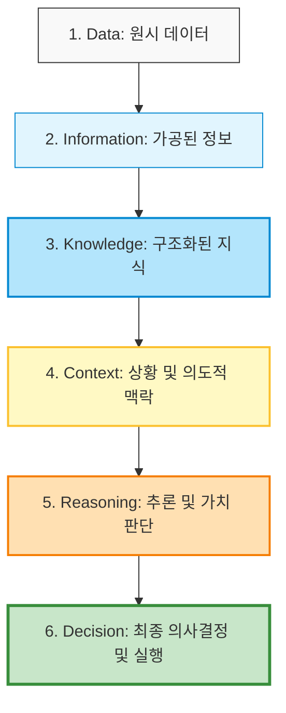
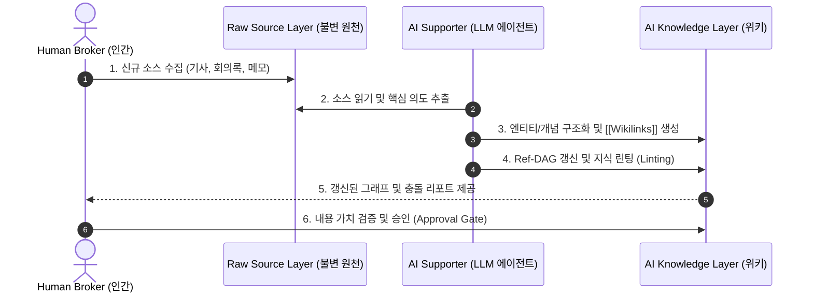

# Human-AI Knowledge Reference Architecture (지식 거버넌스 참조 아키텍처)

> **Document ID**: `0802_human_ai_knowledge_architecture`  
> **Version**: `2.0.0 (Expanded Edition)`  
> **Author**: Antigravity AI & Knowledge Architecture Team  
> **Target Audience**: PKM/KM 구축자, AI 에이전트 설계자, 시스템 아키텍트, 기업 CTO/CDO  

---

## 0. 주요 전문 용어 해설 (Technical Glossary)

문서 본문을 읽기 전 핵심 전문 용어에 대한 정의는 다음과 같습니다.

| 전문 용어 (Term) | 설명 (Definition & Concept) |
| :--- | :--- |
| **Ontology (온톨로지)** | 지식 영역 내의 개념, 엔티티, 그리고 이들 간의 관계를 체계적으로 분류하고 정의한 지식의 구조적 분류 체계입니다. |
| **Provenance (지식 계보/출처성)** | 특정 지식 자산이 누구에 의해, 어떤 원천 데이터로부터, 언제, 어떤 정제 과정을 거쳐 생성되었는지 추적 가능한 출처 기록입니다. |
| **Model Collapse (모델 붕괴)** | AI가 생성한 텍스트나 데이터를 다시 AI의 훈련/수집 소스로 재순환할 때, 확률적 왜곡이 제귀적으로 누적되어 지식의 질이 영구히 퇴화하는 현상입니다. |
| **Knowledge Linting (지식 린팅)** | 코드의 정적 분석처럼 지식 문서 간의 모순, 깨진 링크, 고립된(Orphan) 문서, 오래된(Stale) 주장을 지능적으로 자동 피로 없이 점검하는 과정입니다. |
| **Ref-DAG (Reference Directed Acyclic Graph)** | 문서 간 참조 관계를 방향성이 있고 순환하지 않는 그래프(DAG) 구조로 모델링하여, 특정 소스가 변경되었을 때 하류(Downstream) 문서의 영향을 즉시 추적하는 아키텍처입니다. |
| **Knowledge Broker (지식 중개자)** | 지식 체계에서 '왜(Why)'를 결정하고, 주관적 가치 판단과 목적의식을 가지고 지식의 방향성을 주도하는 인간 주체입니다. |
| **Knowledge Supporter (지식 조력자)** | 인간 중개자의 의도를 받아 지식의 정형화, 인덱싱, 연관 매핑, 정합성 검사를 실시간 수행하는 LLM 및 에이전트 실행 엔진입니다. |
| **Wikilinks (위키링크)** | `[[문서명]]` 형태로 문서와 문서 간의 의미적 교차 참조(Cross-Reference)를 직관적으로 연결하는 마크다운 파싱 규약입니다. |

---

## 1. Knowledge란 무엇인가 (Ontology & Foundations)

기존의 전통적 **DIKW (Data-Information-Knowledge-Wisdom)** 피라미드는 정보의 가공 단계만을 설명할 뿐, 현대 AI 시대의 **의도성(Intentionality)**과 **추론(Reasoning)** 및 **의사결정(Decision)** 메커니즘을 명확히 반영하지 못합니다. 

본 참조 아키텍처에서는 이를 확장하여 **Data부터 Decision까지 연결되는 6단계 지식 파이프라인 온톨로지**를 정립합니다.



### 1.1 지식 파이프라인 6단계 상세 정의

1. **Data (데이터)**:  
   - 관측 가능한 원시 사실, 센서 수치, 시스템 로그, 비정형 raw 텍스트. (예: 서버 에러 로그 타임스탬프, 고객 질문 텍스트)
2. **Information (정보)**:  
   - 의미 있는 맥락 속에서 분류, 정돈, 통계화된 데이터. (예: "에러 로그 500건이 모두 특정 API 호출 실패에 집중되어 있음")
3. **Knowledge (지식)**:  
   - 정보에 경험, 업무 규칙, 개체 간 관계망이 결합하여 문제 해결의 도구로 사용할 수 있는 형태. (예: "특정 API 호출 실패는 DB 커넥션 풀 부족 시 발생함")
4. **Context (상황 및 의도적 맥락)**:  
   - 지식이 적용되는 물리적·사회적·비즈니스적 환경과 **인간의 의도(Intent)**. (예: "현재는 블랙프라이데이 할인 행사 기간이므로 DB 트래픽 증가가 원인임")
5. **Reasoning (추론 및 가치 판단)**:  
   - 맥락과 지식을 종합하여 여러 대안을 평가하고 가치를 판단하는 고차원 사고 과정. (예: "DB 풀을 증설할 것인가, 트래픽을 제한할 것인가에 대한 비용 대 효과 분석")
6. **Decision (의사결정 및 실행)**:  
   - 추론을 바탕으로 내려지는 최종 행위 및 시스템적 커밋. (예: "DB 커넥션 풀을 2배 상향 조절하는 설정 커밋 실행")

### 1.2 지식 주체의 이원화 (Human Knowledge vs AI Knowledge)

이 파이프라인에서 지식은 생성 주체와 작동 메커니즘에 따라 **Human Knowledge**와 **AI Knowledge**로 명확히 나뉩니다.

- **Human Knowledge (인간 지식)**:  
  - 파이프라인의 상위 계층인 **Context, Reasoning, Decision**을 주도합니다. 인간의 비선형적 직관, 경험적 암묵지, 목적의식(Why), 가치관에 기반하여 형성됩니다.
- **AI Knowledge (AI 지식)**:  
  - 파이프라인의 하위 및 중간 계층인 **Data, Information, Knowledge**의 정형화 및 연관 매핑을 주도합니다. 명시적 데이터, 그래프 구조, LLM 요약 자산으로 구성되며 피로 없는 재현성(How/What)을 제공합니다.

---

## 2. 왜 분리해야 하는가 (Imperatives for Separation)

인간 지식과 AI 지식을 단일 레이어로 뒤섞는 기존 RAG 시스템은 지식의 오염, 출처 유실, 오판 시 책임 소모 등의 치명적 문제를 유발합니다. 두 지식 계층의 분리가 필수적인 5가지 당위성은 다음과 같습니다.

### 2.1 Authority (권한과 주체성 경계)
- **문제점**: AI가 생성한 가설이 인간의 검증 없이 시스템의 최종 진실(Policy/Decision)로 승격되는 주체성 혼란이 발생함.
- **해결 원칙**: 지식의 의도와 목적(Why)을 설정하는 주체는 **인간 중개자(Knowledge Broker)**이며, AI는 이를 충실히 구조화하고 지원하는 **조력자(Knowledge Supporter)**로 권한 경계를 엄격히 제한합니다.

### 2.2 Provenance (지식의 계보 및 출처성)
- **문제점**: 지식 파일이 인간의 실제 경험에서 비롯된 것인지, AI가 확증 편향으로 생성해낸 합성 텍스트인지 구별할 수 없어 시스템 신뢰도가 도괴됨.
- **해결 원칙**: 모든 문서에 메타데이터(`author_type: human | ai_generated`)를 강제하여 **진실의 출처(Source of Truth)**와 이력을 명확히 추적합니다.

### 2.3 Lifecycle (차별화된 지식 생애주기)
- **문제점**: 인간의 지식은 신념 개정과 경험에 따라 점진적으로 재해석되는 반면, AI 지식은 정적 린팅(Linting)과 교차 검증에 의해 갱신되므로 단일 방식으로 관리 불가능.
- **해결 원칙**: 인간 지식은 경험적 갱신 주기(Human Review Loop)를 적용하고, AI 지식은 자동화된 CI/CD 린팅 및 그래프 업데이트 프로세스를 적용합니다.

### 2.4 Responsibility (책임 소재의 명확성)
- **문제점**: AI 지식을 그대로 적용하여 서비스 장애나 법적 모순이 발생했을 때 책임 소재(Accountability)가 불분명해짐.
- **해결 원칙**: RACI 모델을 적용하여 AI는 단순 실행자(Responsible), 인간은 최종 책임자(Accountable)로 명확히 할당합니다.

### 2.5 Model Collapse (자기참조적 지식 오염 차단)
- **문제점**: AI가 뱉어낸 환각 텍스트가 위키에 저장되고, 이 위키를 다시 AI가 읽어 답변을 생성하면서 오류가 제귀적으로 증폭되는 현상 발생.
- **해결 원칙**: 원본 인간 지식(Raw Human Layer)을 불변(Immutable) 상태로 격리하고, AI가 생성한 위키는 인간의 승인 관문(Approval Gate)을 거쳐서만 프로덕션 레이어로 승격시킵니다.

---

## 3. Human Knowledge 모델 (Human Model)

### 3.1 5대 핵심 특성 심층 분석

1. **창의적 비선형 사고 (Creative & Non-linear Thinking)**  
   - 기존 데이터의 연관성에 얽매이지 않고, 서로 전혀 다른 분야의 개념을 연결하여 파격적인 아이디어를 도출합니다. (예: 생물학의 면역 체계 개념을 소프트웨어 보안 아키텍처에 적용)
2. **상황적 유연성 및 적응력 (Situational Adaptability & Flexibility)**  
   - 명시된 규칙이나 프로세스가 존재하지 않는 전대미문의 위기 상황에서도 맥락을 파악하고 즉석에서 유연하게 대처합니다.
3. **문화적·사회적 맥락 공유 (Cultural & Social Context Sharing)**  
   - 조직 내의 정치적 뉘앙스, 뉘앙스 차이, 암묵적인 관습 등 문맥(Context) 행간에 숨겨진 의도를 감지합니다.
4. **망각과 재해석을 통한 추상화 (Abstraction via Forgetting & Reinterpretation)**  
   - 인간의 뇌는 사소한 세부사항을 의도적으로 잊음으로써(Forgetting), 본질적인 법칙과 핵심 원리를 고차원적으로 추상화(Abstraction)합니다.
5. **목적의식 및 자기의도성 (Purposefulness & Self-Intentionality)**  
   - "이 프로젝트를 왜 수행해야 하는가?"라는 본질적 목적(Why)과 동기를 부여합니다.

### 3.2 장점 및 한계 분석
- **장점**: 고차원 가치 부여, 비정형 예외 상황 해결력, 지식의 획기적 도약.
- **한계**: 인간의 기억 용량 한계(휘발성), 정리 및 인덱싱 작업의 극심한 피로도, 개인적 감정/편향 개입.

---

## 4. AI Knowledge 모델 (AI Model)

### 4.1 5대 핵심 특성 심층 분석

1. **명시적 데이터화 및 구조화 (Explicit Datafication & Structuring)**  
   - 인간이 쏟아내는 두서없는 메모, 회의록, 기사를 표준화된 마크다운, 태그, 헤더 구조로 즉각 정돈합니다.
2. **논리적 일관성 및 재현성 (Logical Consistency & Reproducibility)**  
   - 동일한 조건과 스키마 하에서 수백 개의 문서를 작성할 때 논리적 형식과 구문의 일관성을 지킵니다.
3. **지속적 축적 및 상호 연결성 (Continuous Compounding & Interlinkage)**  
   - 새로운 소스가 유입되면 기존 지식 문서 10~20개와 상호 참고 링크(`[[wikilinks]]`)를 생성하여 지식의 복리 효과(Compounding)를 창출합니다.
4. **무한한 연관성 및 그래프 매핑 (Infinite Relation Graph Mapping)**  
   - 수천 개 개념 문서 간의 의존성 및 개체 관계망을 실시간 그래프(Ref-DAG)로 유지합니다.
5. **정합성 검증 및 린팅 자동화 (Automated Consistency Auditing & Linting)**  
   - 깨진 링크, 고립된 문서, 이전 주장과의 논리적 충돌을 피로감 없이 24/7 지속적으로 감시하고 린팅합니다.

### 4.2 장점 및 한계 분석
- **장점**: 피로가 없는 무제한 유지보수, 대규모 지식의 초고속 검색 및 정제, 완벽한 구조적 정리.
- **한계**: 주체적 의도 부재(Why를 스스로 생성 불가), 환각 가능성, 깊은 인간적 경험 맥락 오해.

---

## 5. 비교 프레임워크 (Comparison Framework)

인간 지식과 AI 지식의 10대 핵심 차원별 비교 스펙트럼 매트릭스입니다.

| 비교 차원 (Dimension) | Human Knowledge (인간 지식) | AI Knowledge (AI 지식) |
| :--- | :--- | :--- |
| **1. 주 역할 (Primary Role)** | **지식 융합 중개자 (Knowledge Broker)** | **지식 조력자 (Knowledge Supporter)** |
| **2. 핵심 동력 (Core Driver)** | 목적의식, 가치관, 의도 (**Why**) | 구조화, 연산, 무결성 (**How/What**) |
| **3. 사고 패턴 (Cognition)** | 비선형적·창의적 도약 | 선형적·통계적 패턴 연관 |
| **4. 지식 형태 (Form)** | 암묵지, 경험, 비정형 텍스트 | 명시적 마크다운, 태그, Ref-DAG |
| **5. 유지보수 (Maintenance)** | 피로도가 높아 쉽게 방치됨 | 자동화된 린팅(Linting)으로 피로 없음 |
| **6. 출처성 (Provenance)** | **근본적 원천 (Source of Truth)** | 파생된 합성/구조화 지식 |
| **7. 주요 오류 (Error Mode)** | 건망증, 개인적 편향, 감정 오판 | 환각(Hallucination), 맥락 오해 |
| **8. 갱신 메커니즘 (Update)** | 경험 및 사건 발생 시 불규칙 갱신 | 소수 유입 시 즉시 및 스케줄링 린팅 |
| **9. 확장성 (Scalability)** | 개인의 뇌 용량 한계 존재 | 무제한 스토리지 및 노드 확장 |
| **10. 법적/윤리적 책임** | **최종 책임 보유 (Accountable)** | 책임 불가능 (Execution Engine) |

---

## 6. Cross Reference Architecture (상호 참조 아키텍처)

인간 지식과 AI 지식이 안전하게 교차 작동하는 상호 참조 아키텍처 규약입니다.

### 6.1 지식 교차 파이프라인 흐름 (Knowledge Dataflow)



### 6.2 표준 메타데이터 스키마 (YAML Frontmatter Specification)

모든 위키 마크다운 문서는 지식 출처성(Provenance) 및 주체 구분을 위해 이하 표준 스키마를 준수합니다.

```yaml
---
id: "doc-2026-0802-001"
title: "Human-AI Knowledge Reference Architecture"
type: "concept" # source | entity | concept | synthesis | log
author_type: "human" # human (인간 작성) | ai_generated (AI 완전 생성) | ai_synthesized (인간-AI 합성)
status: "production" # draft | review_pending | production | deprecated
provenance:
  raw_source_path: "raw/sources/2026_karpathy_gist.pdf"
  created_by: "chaehwan"
  approved_by: "chaehwan"
  confidence_score: 0.98
refs:
  - "[[0802_knowledge_classification]]"
  - "[[llm_wiki_karpathy]]"
last_linted_at: "2026-08-02T17:00:00Z"
---
```

---

## 7. Governance (지식 거버넌스 체계)

지식 자산의 오염을 막고 품질을 유지하기 위한 4대 거버넌스 기둥입니다.

```
+-------------------------------------------------------------------+
|                     HUMAN KNOWLEDGE BROKER                        |
|            (Sets Intent, Evaluates Value, Grants Approval)        |
+-------------------------------------------------------------------+
                                 |
                          [Approval Gate]
                                 v
+-------------------------------------------------------------------+
|                     AI KNOWLEDGE SUPPORTER                        |
|        (Indexes, Links Ref-DAG, Lints Consistency 24/7)           |
+-------------------------------------------------------------------+
```

### 7.1 승인 관문 (Approval Gate)
AI 에이전트가 생성한 문서나 다수 문서에 대한 업데이트는 즉시 프로덕션에 반영되지 않고 `status: review_pending` 상태로 대기합니다. 인간 중개자가 내용의 가치를 검증하고 승인할 때만 최종 반영됩니다.

### 7.2 버전 관리 (Git Versioning)
모든 지식 파일은 Git 버전 관리를 거칩니다. 커밋 메시지는 지식 변경 사유를 명시하며, 오류 발생 시 이전 안정 버전으로 완전 롤백이 가능합니다.

### 7.3 RACI 책임 구조
- **Responsible (실행)**: AI Supporter (LLM 에이전트) - 요약, 정형화, 링크 매핑 수행.
- **Accountable (최종 책임)**: Human Broker (인간) - 지식의 진실성 및 결과 의사결정 책임.
- **Consulted (조언)**: 분야별 인간 전문가 및 도메인 개체.
- **Informed (통보)**: 시스템 활용 유저 및 협업 Sub-Agent.

### 7.4 자동화된 감사 및 린팅 (Audit & Linting Workflow)
1. **Orphan Audit**: 어느 문서에서도 참조되지 않는 고립 문서 탐지 및 링크 연결 추천.
2. **Contradiction Audit**: 기존 지식 문서와 신규 문서 간 주장의 충돌 감지 및 리포팅.
3. **Stale Claim Pruning**: 작성된 지 오랫동안 갱신되지 않은 오래된 주장에 대한 재검토 알림.

---

## 8. Agent Protocol (에이전트 실행 프로토콜)

### 8.1 Prompting Protocol (시스템 프롬프트 주입)
에이전트에게 권한 경계를 인지시키기 위한 필수 규약 프롬프트 예시:
```text
[SYSTEM PROTOCOL]
1. You are a 'Knowledge Supporter Agent'. 
2. You MUST NOT override Human Intent (Why).
3. Always check 'author_type' in frontmatter. Never modify 'author_type: human' original text without permission.
4. When adding new information, create [[Wikilinks]] and update the index.md file.
```

### 8.2 Routing Protocol (지식 추론 경로 제어)
- **질의 유형이 '의도/가치판단/방향성'인 경우**: Human Knowledge Layer 우선 참조 후 사용자에게 연결.
- **질의 유형이 '사실검색/개념연관/요약'인 경우**: AI Knowledge Graph 및 `index.md` 구조체 즉시 검색 후 답변.

### 8.3 Tool Calling Protocol (MCP / Agent Tools)
에이전트가 위키 관리를 수행할 때 호출하는 표준 도구 규약:
- `search_wiki_index(query)`: 위키 색인 검색.
- `lint_knowledge_graph()`: 고립 노드 및 충돌 감지.
- `commit_wiki_update(filepath, content, commit_msg)`: 검토 요청 커밋 생성.

---

## 9. 사례 연구 (Use Cases & Applications)

### 9.1 개인 (PKM): Personal Knowledge Management
- **환경**: Obsidian + Local LLM / Claude Code + Git
- **적용 패턴**: 사용자는 일기와 아이디어(Human Layer)만 작성. LLM 에이전트가 이를 읽어 개념 문서(AI Layer)로 정리하고 `index.md`에 링크를 자동 매핑.

### 9.2 팀 (Team KM): Collaborative Knowledge Base
- **환경**: Git Repository + GitHub Actions + PR Review
- **적용 패턴**: 회의록이 제출되면 AI 에이전트가 자동 린팅 및 관련 PR 생성. 인간 팀장이 내용 검토 후 Merge 승인.

### 9.3 기업 (Enterprise KM): Enterprise Governance Architecture
- **환경**: Enterprise Knowledge Graph + Multi-Agent Pipeline + Vector DB
- **적용 패턴**: 사내 규정과 매뉴얼의 출처성(Provenance)을 엄격히 관리하여 환각 및 규정 위반 답변을 근본적으로 차단.

---

## 10. 향후 발전 방향 (Future Outlook)

본 참조 아키텍처는 **인간의 창의적 목적의식**과 **AI의 피로 없는 시스템 관리 능력**을 완벽히 결합하는 **공생적 지식 생태계(Symbiotic Knowledge Ecosystem)**의 이정표입니다.

이 지식 거버넌스 체계를 준수함으로써 개인과 조직의 지식 자산은 시간이 지나도 오염되지 않고, 복리(Compounding)로 축적되는 가치를 발휘할 것입니다.
