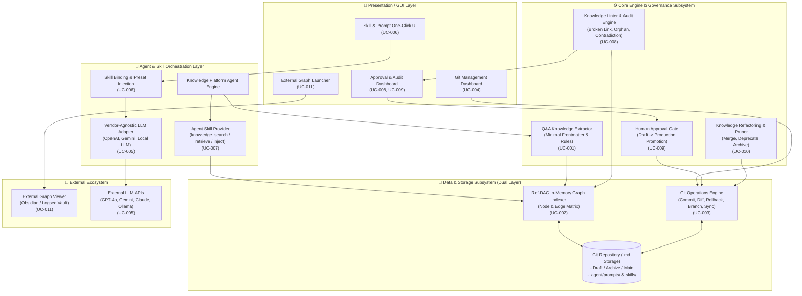
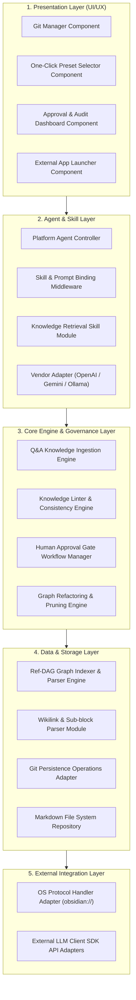

# Knowledge Platform Overall Architecture & Use Case Specifications

> **Document ID**: `0816_knowledge_platform_architecture_spec`  
> **Date**: 2026-08-16  
> **Author**: Antigravity AI & Knowledge Architecture Team  
> **Related Requirements Document**: [.doc/0816_requirements_and_nfr_spec.md](file:///home/chaehwan/bifacewiki/bifacewiki/.doc/0816_requirements_and_nfr_spec.md)  
> **Status**: Approved Reference Architecture (Final Specification)  

---

## 1. Knowledge Platform Overall Architecture (전체 아키텍처)

### 1.1 아키텍처 개요 및 설계 철학
본 지식 플랫폼(Knowledge Platform)은 **"Human Knowledge(인간 지식)와 AI Knowledge(AI 지식)의 명확한 역할 분리 및 상호 보완적 공생"**을 핵심 철학으로 설계되었습니다. 

- **Dual-Layer Architecture (이중 레이어 아키텍처)**:
  - **Physical Layer (물리 저장소 레이어)**: DB 없이 파일 시스템 기반의 Git 저장소에 **"1개 파일 = 1개 원자적 주제(Atomic Knowledge Page)"** 단위의 Markdown 문서로 보존됩니다.
  - **Logical Layer (논리 그래프 레이어)**: 문서 내의 Frontmatter 메타데이터와 `[[Wikilinks]]` 파싱을 통해 형성되는 **Ref-DAG (Reference Directed Acyclic Graph)** 인덱스 체계입니다.
- **Human-AI Duality & Authority Boundary (주체성 및 권한 경계)**:
  - **Human Knowledge Broker (인간 중개자)**: 의도(Why), 가치 판단, 최종 승인 권한(Accountable)을 보유합니다.
  - **AI Knowledge Supporter (AI 조력자)**: 지식의 정형화, Wikilinks 연관 연결, Ref-DAG 유지, 24/7 지식 린팅(Linting) 및 수명주기 관리를 피로 없이 수행(Responsible)합니다.

### 1.2 End-to-End System Architecture (전체 아키텍처 다이어그램)

---

## 2. Knowledge Platform Module View (모듈 뷰)

지식 플랫폼의 모듈 구조는 관심사 분리(Separation of Concerns) 및 높은 확장성을 보장하기 위해 5개의 핵심 계층 모듈로 분류됩니다.

### 2.1 계층별 모듈 상세 규격

| 계층 (Layer) | 주요 모듈 (Module) | 핵심 역할 및 책임 (Responsibilities) | 관련 UC |
| :--- | :--- | :--- | :--- |
| **1. Presentation Layer** | `GitManagerComponent` | Git 저장소 상태 표시, Sync(Push/Pull) 제어, Diff 시각화 | UC-004 |
| | `PresetSelectorComponent` | `.agent/` 내 프롬프트/스킬 프리셋 렌더링 및 클릭 바인딩 이벤트 처리 | UC-006 |
| | `ApprovalDashboardComponent` | Draft 지식 검토 UI, Diff 비교, 린팅 이슈 확인 및 Approve/Reject 액션 처리 | UC-008, UC-009 |
| | `ExternalLauncherComponent` | external graph launcher 버튼 렌더링 및 OS URI scheme 호출 | UC-011 |
| **2. Agent & Skill Layer** | `AgentController` | 사용자 질의 처리, Agent 추론 루프 제어 및 도구 호출 조율 | UC-001, UC-007 |
| | `SkillBindingMiddleware` | 선택된 `SKILL.md` 및 System Prompt를 런타임 LLM 세션에 주입 | UC-006 |
| | `KnowledgeRetrievalSkill` | LLM의 Tool Call 요청을 받아 Ref-DAG 인덱스 기반 Context 조립 및 주입 | UC-007 |
| | `LLMVendorAdapter` | OpenAI, Gemini, Claude, Ollama 등의 규격 차이를 흡수하는 추상 어댑터 | UC-005 |
| **3. Core Engine Layer** | `KnowledgeIngestionEngine` | Q&A 대화 정제, 3대 단순 규칙 준수 Markdown 및 Minimal Frontmatter 생성 | UC-001 |
| | `KnowledgeLinterEngine` | 깨진 Wikilinks, Orphan Node, 스키마 오차, Contradiction 정적 린팅 | UC-008 |
| | `ApprovalGateManager` | Draft 문서의 lifecycle 제어 (`draft` -> `production`), 브랜치 병합 관리 | UC-009 |
| | `GraphRefactoringEngine` | 유사 노드 자동 통합(Merge), Stale Node 폐기(Deprecate/Archive) | UC-010 |
| **4. Data & Storage Layer** | `RefDAGIndexerEngine` | 마크다운 파일 파싱, Node & Edge 매트릭스 구성, 메모리 인덱스 관리 | UC-002 |
| | `WikilinkParser` | `[[Wikilinks]]` 및 `# Heading` 서브블록 파싱 | UC-002 |
| | `GitOperationsAdapter` | `git add/commit/push/pull/diff/revert` 등 low-level Git API 실행 | UC-003 |
| | `MarkdownRepository` | 로컬 디렉토리 마크다운 파일 CRUD 및 버전 파일 입출력 | UC-003 |
| **5. External Integration** | `OSProtocolAdapter` | `obsidian://open` 등 OS 레벨 프로토콜 핸들러 실행 | UC-011 |
| | `ExternalLLMClientSDK` | 외부 Vendor LLM REST/gRPC API 통신 처리 | UC-005 |

---

## 3. Use Case Detail Specifications (유스케이스 세부 명세서 UC-001 ~ UC-011)

> [!NOTE]
> 본 명세서의 추적성(Traceability: `REQ`, `DSGN`, `TEST`) 및 비기능 요구사항(`NFR`) 코드의 세부 명세는 [.doc/0816_requirements_and_nfr_spec.md](file:///home/chaehwan/bifacewiki/bifacewiki/.doc/0816_requirements_and_nfr_spec.md)에 상세히 정의되어 있습니다.

---

### UC-001: Q&A 지식 추출 및 저장

| 구분 | 항목 | 주요 내용 |
| :--- | :--- | :--- |
| **식별** | **Use Case ID** | `UC-001` |
| | **Use Case Name** | Q&A 지식 추출 및 저장 (Q&A Knowledge Ingestion & Extraction) |
| **목적** | **Goal** | 사용자와 LLM 간 대화(Q&A) 중 발생한 성공적 해결책 뿐만 아니라 **시도했으나 실패한 / 하지 말아야 할 동작(Negative Knowledge)**을 추출하여 원자적(Atomic) 마크다운 지식 노드로 저장함. |
| **범위** | **Scope** | Q&A Conversation Context Parsing, Knowledge Extractor Engine, Minimal Frontmatter Generator. |
| **행위자** | **Primary Actor** | Human User (사용자) |
| | **Secondary Actor** | Platform Knowledge Agent, LLM Provider (OpenAI/Gemini/Local) |
| **조건** | **Preconditions** | 1. 사용자와 LLM 간 Q&A 대화가 진행 중이거나 대화 세션 로그가 수집 완료된 상태이어야 함. 2. Knowledge Ingestion Prompt (`.agent/prompts/qa_ingest.md`)가 시스템에 등록되어 있어야 함. |
| | **Trigger** | 1. 사용자가 대화창에서 "이 대화 내용을 지식으로 저장해줘" 명령 입력. 2. Agent가 유의미한 문제 해결 맥락 감지 시 지식 저장 추천 위젯 노출. |
| **기본 흐름** | **Main Flow** | 1. 사용자/에이전트가 Q&A 세션에서 지식 추출 작업을 시작함. 2. Knowledge Ingestion Engine이 대화 내용을 분석하여 핵심 쟁점 및 해결책을 1개의 원자적(Atomic) 주제로 요약함. 3. 대화 내용 중 안티패턴, 오류 유발 원인 등 **Negative Knowledge**가 포함된 경우 `type: negative_knowledge` 메타데이터 및 주의사항 구조를 생성함. 4. LLM 지식 생성 3대 단순 규칙(Rule 1: Minimal Frontmatter `type`, `title`, Rule 2: Simple Wikilinks `[[지식명]]`, Rule 3: Single Topic Focus)을 적용한 Markdown 텍스트를 작성함. 5. Platform Agent 백엔드가 파일명 기반 고유 Node ID, `created_at`, `author_type: ai_generated`, `status: draft` 메타데이터를 자동 결합함. 6. 작성된 문서를 Draft 지식 디렉토리에 저장하고 Ref-DAG 임시 노드로 수록함. |
| **대안 흐름** | **Alternative Flow** | **2a. 대화 주제가 다중/복합적인 경우**: 지식 추출 엔진이 주제별로 여러 개의 소형 Atomic Markdown 파일로 분할 생성하고 각 문서 간 `[[Wikilinks]]`로 상호 참조 연결함. **3a. 긍정적 표준 해결책인 경우**: `type: solution` 또는 `type: concept`으로 메타데이터를 설정함. |
| **예외** | **Exception Flow** | **E1. 대화 내용의 지식 가치 미달 또는 환각(Hallucination) 심화 시**: Agent가 지식 추출 불가 사유를 메세지로 출력하고 사용자에게 대화 보완을 요청함. **E2. 파일 시스템 쓰기 권한 오류**: 에러 로그 기록 후 UI에 경고 토스트 팝업 출력. |
| **종료** | **Postconditions** | 생성된 지식 문서가 `status: draft` 상태로 저장소에 저장되고, 인간 검증 및 승인 관문(UC-009)의 검토 대기 큐에 등록됨. |
| **데이터** | **Input** | Q&A 대화 히스토리 (Prompt/Completion Log), 지식 분류 힌트/태그. |
| | **Output** | YAML Frontmatter 및 Wikilinks가 포함된 Atomic Markdown 지식 파일 (`.md`). |
| **규칙** | **Business Rule** | **BR-001-1**: 파일 1개당 반드시 1개의 원자적(Atomic) 주제만 다루어야 함 (Atomic Knowledge Pattern). **BR-001-2**: 실패 사례(Negative Knowledge)는 삭제하거나 은폐하지 않고 `type: negative_negative` 노드로 독립시켜 LLM 재발 방지 레퍼런스로 활용함. |
| **인터페이스** | **UI/API** | API: `POST /api/v1/knowledge/extract` UI: 대화창 하단 `[Save as Knowledge Node]` 버튼 및 Card Widget |
| **의존성** | **Dependency** | UC-002 (Node & Edge 분류 파서), UC-003 (Git 저장소), UC-009 (인간 승인 관문). |
| **비기능** | **NFR** | `NFR-PERF-01` (추출 응답 < 3초), `NFR-MAINT-02` (Atomic 지식 단일 규약) |
| **추적성** | **Traceability** | Requirement: `REQ-INGEST-01`, `REQ-INGEST-02` Design: `DSGN-CORE-INGEST` Test: `TEST-UC001-01`, `TEST-UC001-02` |

---

### UC-002: Node & Edge 체계적 분류

| 구분 | 항목 | 주요 내용 |
| :--- | :--- | :--- |
| **식별** | **Use Case ID** | `UC-002` |
| | **Use Case Name** | Node & Edge 체계적 분류 (Node & Edge Structure & Parsing) |
| **목적** | **Goal** | 저장소 내 지식 마크다운 문서들을 구조화된 Node 및 문서 간 연관 관계인 Edge(Ref-DAG)로 파싱하고 인덱싱하여 그래프 지식 체계를 구축함. |
| **범위** | **Scope** | Ref-DAG In-Memory Indexer Engine, Frontmatter Parser, Wikilinks Extractor, Sub-block Indexer. |
| **행위자** | **Primary Actor** | Platform Agent (Graph Indexer Engine) |
| | **Secondary Actor** | Storage System (Git Repository File System) |
| **조건** | **Preconditions** | 1. 마크다운 지식 파일이 지정된 지식 디렉토리 내에 저장되어 있어야 함. |
| | **Trigger** | 1. 신규 지식 파일 저장/수정/삭제 완료 이벤트 발생. 2. Git Sync(Pull/Commit) 완료 시 인덱서 자동 실행. |
| **기본 흐름** | **Main Flow** | 1. Graph Indexer가 마크다운 파일의 YAML Frontmatter를 파싱하여 Node 속성 (`id`, `title`, `type`, `status`, `author_type`)을 추출함. 2. 파일 본문 내 `[[node-id]]` 위키링크 문법을 스캔하여 명시적 참조 Edge (`references`)를 추출함. 3. Frontmatter 내 `prerequisite`, `supersedes` 필드를 분석하여 방향성 메타 Edge (`depends_on`, `replaces`)를 생성함. 4. 1개 파일로 존재하는 긴 문서의 경우 Heading (`# Section`, `## Subsection`)을 서브 노드(Child Sub-Block)로 논리 파싱함. 5. 추출된 Node와 Edge를 바탕으로 Ref-DAG (Reference Directed Acyclic Graph) 메모리 인덱스 데이터를 갱신함. |
| **대안 흐름** | **Alternative Flow** | **4a. 임베딩 기반 시맨틱 유사도 파싱 활성화 시**: 임베딩 유사도 0.85 이상인 노드 간 Semantic Edge (`semantically_related`)를 자동 연동함. |
| **예외** | **Exception Flow** | **E1. Frontmatter YAML 문법 오류**: 해당 파일의 노드 구성을 일시 보류하고 린팅 엔진(UC-008) 이슈 큐에 등록함. |
| **종료** | **Postconditions** | Ref-DAG 그래프 인덱스가 최신 상태로 업데이트되어 Agent 탐색 및 LLM 지식 주입(UC-007)에 즉시 활용 가능해짐. |
| **데이터** | **Input** | Raw Markdown Documents (`.md`). |
| | **Output** | Ref-DAG In-Memory Graph Object, Node List, Edge Matrix, `index.json`. |
| **규칙** | **Business Rule** | **BR-002-1**: 모든 노드는 파일명 또는 Frontmatter `id`와 1:1 대칭 매핑되는 고유 Node ID를 가져야 함. **BR-002-2**: 지식 간의 의존성 관계는 순환(Circular Dependency)이 발생하지 않는 Directed Acyclic Graph (DAG) 규칙을 준수해야 함. |
| **인터페이스** | **UI/API** | API: `GET /api/v1/graph/nodes`, `GET /api/v1/graph/edges` Engine Internal: `GraphIndexer.reindex_all()` |
| **의존성** | **Dependency** | UC-001 (Q&A 추출), UC-008 (지식 린팅). |
| **비기능** | **NFR** | `NFR-PERF-02` (파싱 < 1초, 메모리 < 100MB), `NFR-RELI-03` (DAG 순환방지), `NFR-MAINT-02` (Atomic 규약) |
| **추적성** | **Traceability** | Requirement: `REQ-GRAPH-01`, `REQ-GRAPH-02` Design: `DSGN-INDEXER-DAG` Test: `TEST-UC002-01` |

---

### UC-003: Git Repository 저장 및 관리 편의성

| 구분 | 항목 | 주요 내용 |
| :--- | :--- | :--- |
| **식별** | **Use Case ID** | `UC-003` |
| | **Use Case Name** | Git Repository 저장 및 관리 편의성 (Git Persistence & Operations) |
| **목적** | **Goal** | RDBMS/NoSQL 등 별도 DB 구축 없이 파일 시스템 기반 Git 저장소를 지식의 단일 진실 원천(Source of Truth)으로 활용하여 버전 관리, 이력 추적, Diff 비교, 롤백 편의성을 제공함. |
| **범위** | **Scope** | Git Operations Engine, Git Local/Remote Sync Manager, Version Control Adapter. |
| **행위자** | **Primary Actor** | Platform Storage Subsystem |
| | **Secondary Actor** | Git CLI / Libgit2 / Remote Hosting (GitHub/GitLab) |
| **조건** | **Preconditions** | 1. 지식 저장소 디렉토리에 `.git` 저장소가 초기화되어 있어야 함. 2. 필요 시 원격 저장소 URL 및 인증 정보가 구성되어 있어야 함. |
| | **Trigger** | 1. 승인된 지식 파일의 저장/수정/삭제 요청. 2. 사용자의 Git Sync(Push/Pull) 및 롤백 명령 실행. |
| **기본 흐름** | **Main Flow** | 1. 지식 파일 변경 사항(생성/수정/삭제)을 Git 스테이징 영역에 등록 (`git add`). 2. 변경 목적, 주체, 관련 Node ID가 포함된 구조화된 커밋 메시지를 자동 생성함. 3. Local Git Commit을 실행하여 이력을 영속화함. 4. 원격 저장소가 설정된 경우 비동기 백그라운드로 `git push` 및 `git pull`을 수행함. 5. 커밋 Hash 및 변경 Diff 로그를 플랫폼 관리 이력으로 저장함. |
| **대안 흐름** | **Alternative Flow** | **4a. 원격 저장소 충돌(Merge Conflict) 발생 시**: 시스템이 변경 사항을 Auto-stash 후 최신 원격 변경을 Pull하고, 충돌 발생 파일 목록을 UI 승인/관리 큐에 알림. |
| **예외** | **Exception Flow** | **E1. Git 인증 실패 (SSH/Token 만료)**: Git 작업 중단 후 UI에 인증 재설정 유도 알림 노출. **E2. 디스크 용량 부족 또는 파일 락**: 에러 기록 후 안전한 트랜잭션 롤백 수행. |
| **종료** | **Postconditions** | 지식 문서의 변경 내역이 Git 커밋 이력으로 안전하게 영속화되며 과거 임의 시점으로의 이력 복구가 가능해짐. |
| **데이터** | **Input** | 지식 마크다운 파일, 커밋 메세지 템플릿, 원격 Repo 설정. |
| | **Output** | Git Commit Hash, Commit History Log, Diff Stream, Sync Status. |
| **규칙** | **Business Rule** | **BR-003-1**: 모든 지식 변경은 원자적 Git 커밋으로 기록되어야 하며 파일 직접 무단 덮어쓰기 금지. **BR-003-2**: 커밋 메세지에는 작성 주체 (`author_type`) 및 관련 Node ID 정보가 명시되어야 함. |
| **인터페이스** | **UI/API** | API: `POST /api/v1/git/commit`, `POST /api/v1/git/sync` Engine Internal: `GitOperationsAdapter.commit()` |
| **의존성** | **Dependency** | UC-004 (Git UI), UC-009 (인간 승인 후 메인 저장소 커밋). |
| **비기능** | **NFR** | `NFR-PERF-03` (Commit < 500ms), `NFR-SEC-02` (인증 보안), `NFR-RELI-01` (데이터 손실 0%) |
| **추적성** | **Traceability** | Requirement: `REQ-STORAGE-01`, `REQ-STORAGE-02` Design: `DSGN-GIT-ADAPTER` Test: `TEST-UC003-01` |

---

### UC-004: Git 생성 및 관리를 위한 UI 제공

| 구분 | 항목 | 주요 내용 |
| :--- | :--- | :--- |
| **식별** | **Use Case ID** | `UC-004` |
| | **Use Case Name** | Git 생성 및 관리를 위한 UI 제공 (Git Management GUI & Dashboard) |
| **목적** | **Goal** | Git CLI 커맨드에 익숙하지 않은 사용자도 대시보드를 통해 클릭 몇 번으로 Git 저장소 생성, 동기화(Push/Pull), 이력 조회, 롤백을 수행할 수 있는 GUI를 제공함. |
| **범위** | **Scope** | Git Management Web Dashboard, Git Status Widget, Visual Diff Viewer. |
| **행위자** | **Primary Actor** | Human User (사용자) |
| | **Secondary Actor** | Git Operations Engine, Web Frontend UI |
| **조건** | **Preconditions** | 1. 사용자가 Knowledge Platform Web UI 대시보드에 접속한 상태이어야 함. |
| | **Trigger** | 대시보드 내 [신규 저장소 생성], [Sync Now], [커밋 이력], [Rollback] 버튼 클릭. |
| **기본 흐름** | **Main Flow** | 1. 사용자가 UI 상에서 [신규 Git 저장소 생성] 버튼 클릭 후 경로 및 원격 URL 입력. 2. 백엔드가 `git init` 또는 `git clone`을 실행하고 결과를 대시보드 카드로 렌더링. 3. 현재 변경된 파일 상태(Staged/Unstaged/Committed)를 시각적 파일 카드로 표시. 4. 사용자가 [Sync Now] 버튼 클릭 시 Push/Pull 상태바(Progress Bar)를 실시간 출력. 5. 커밋 타임라인 클릭 시 변경된 마크다운 내용의 Visual Line-by-Line Diff 뷰어 출력. |
| **대안 흐름** | **Alternative Flow** | **5a. 특정 커밋 롤백 요청 시**: 사용자가 타임라인에서 [Rollback to This Commit] 클릭 시 안전하게 revert 커밋을 생성하고 UI 갱신. |
| **예외** | **Exception Flow** | **E1. 지정 저장소 디렉토리 접근 권한 오류**: UI에 경고 메시지 토스트 출력 및 경로 재지정 폼 제공. |
| **종료** | **Postconditions** | CLI 작업 없이 UI 상에서 저장소 생성, Sync 및 이력 관리가 완결되고 대시보드에 최신 상태가 반영됨. |
| **데이터** | **Input** | UI 버튼 클릭 이벤트, 저장소 경로, 원격 저장소 URL, Auth Token. |
| | **Output** | Git Status Dashboard View, Commit History Timeline, Visual Diff Screen. |
| **규칙** | **Business Rule** | **BR-004-1**: 복잡한 Git CLI 시스템 에러를 사용자 친화적인 직관적 한글 메세지 및 조치 가이드로 전환하여 노출함. |
| **인터페이스** | **UI/API** | UI Component: `GitStatusDashboard`, `CommitTimelineWidget`, `DiffViewerModal` API: `GET /api/v1/git/status` |
| **의존성** | **Dependency** | UC-003 (Git Repository Engine). |
| **비기능** | **NFR** | `NFR-PERF-03` (GUI 반영 < 200ms), `NFR-SEC-02` (인증/권한) |
| **추적성** | **Traceability** | Requirement: `REQ-UI-GIT-01`, `REQ-UI-GIT-02` Design: `DSGN-UI-DASHBOARD` Test: `TEST-UC004-01` |

---

### UC-005: Vendor-Agnostic 지식 유지

| 구분 | 항목 | 주요 내용 |
| :--- | :--- | :--- |
| **식별** | **Use Case ID** | `UC-005` |
| | **Use Case Name** | Vendor-Agnostic 지식 유지 (Vendor-Agnostic Knowledge Access Layer) |
| **목적** | **Goal** | 특정 LLM 제공자(OpenAI, Gemini, Claude, Local Ollama 등)에 종속되지 않고 독립된 단일 마크다운 지식 창구를 유지하여 LLM 교체 시에도 지식 자산을 완전 보존 및 재활용함. |
| **범위** | **Scope** | LLM Vendor Adapter Engine, Universal Knowledge Context Injector, Prompt Binding Standard. |
| **행위자** | **Primary Actor** | System Architect / Platform Agent |
| | **Secondary Actor** | External LLM Vendors (OpenAI GPT, Google Gemini, Anthropic Claude, Local LLM) |
| **조건** | **Preconditions** | 1. 지식 저장소가 마크다운 및 Ref-DAG 표준 포맷으로 유지되고 있어야 함. |
| | **Trigger** | 1. 사용자의 LLM 벤더 변경 설정 (UI 드롭다운 벤더 선택). 2. 멀티 LLM 크로스 검증을 위한 동시 모델 추론 요청. |
| **기본 흐름** | **Main Flow** | 1. 사용자가 UI 설정에서 활성 LLM 공급자를 변경함 (예: OpenAI GPT-4o -> Google Gemini 1.5 Pro). 2. Platform Agent가 Universal Prompt/Skill 규약(UC-006, UC-007)을 해당 벤더 API 요청 포맷으로 자동 번역/어댑팅함. 3. 물리 저장소의 Markdown 문서와 Ref-DAG 인덱스는 벤더 변경과 무관하게 변함없이 유지됨. 4. 신규 선택된 LLM으로 질의 전달 시 동일한 표준 Knowledge Context가 주입되어 동일 수준의 답변 렌더링. |
| **대안 흐름** | **Alternative Flow** | **4a. 로컬 LLM (Ollama / Llama.cpp) 사용 시**: 외부 네트워크 통신 없이 완벽히 폐쇄된 사내/로컬 저장소만을 탐색하여 답변 생성. |
| **예외** | **Exception Flow** | **E1. 선택 벤더 API Key 미설정 또는 호출 한도 초과**: UI 알림 발행 및 시스템 사전 지정 Fallback LLM 벤더로 자동 전환. |
| **종료** | **Postconditions** | LLM 공급자 변경 후에도 기존 지식 저장소의 데이터 수정 없이 온전한 연동 서비스가 유지됨. |
| **데이터** | **Input** | LLM Vendor Settings (Vendor Code, API Key, Endpoint), Standard Context Object. |
| | **Output** | Vendor-Specific REST/gRPC API Envelope (Formatted with Knowledge Context). |
| **규칙** | **Business Rule** | **BR-005-1**: 지식 데이터 포맷은 특정 벤더 전용 임베딩 DB나 고유 포맷에 종속 저장되어서는 안 되며 100% 표준 마크다운을 준수함. |
| **인터페이스** | **UI/API** | API: `PUT /api/v1/settings/llm-vendor` Engine Internal: `LLMVendorAdapter.invoke()` |
| **의존성** | **Dependency** | UC-003 (Git 저장소), UC-007 (Agent/Skill 지식 제공). |
| **비기능** | **NFR** | `NFR-SEC-03` (로컬 LLM 데이터 격리), `NFR-MAINT-01` (LLM 벤더 이관 비용 0건) |
| **추적성** | **Traceability** | Requirement: `REQ-PLATFORM-01` Design: `DSGN-LLM-ADAPTER` Test: `TEST-UC005-01` |

---

### UC-006: Skill & Prompt 원클릭 주입 UI 제공

| 구분 | 항목 | 주요 내용 |
| :--- | :--- | :--- |
| **식별** | **Use Case ID** | `UC-006` |
| | **Use Case Name** | Skill & Prompt 원클릭 주입 UI 제공 (One-Click Skill & Prompt Binding UI) |
| **목적** | **Goal** | 수동 복사/붙여넣기 없이 UI 클릭 한번으로 `.agent/prompts/` 및 `SKILL.md`에 정의된 프롬프트/스킬 프리셋을 LLM 런타임 환경에 자동 바인딩함. |
| **범위** | **Scope** | One-Click Binding Web UI Component, Skill Registry, Prompt Injector Middleware. |
| **행위자** | **Primary Actor** | Human User (사용자) |
| | **Secondary Actor** | Platform Agent, LLM Runtime Session Manager |
| **조건** | **Preconditions** | 1. `.agent/prompts/` 및 `.agent/skills/` 디렉토리에 프롬프트/스킬 정의 파일이 작성되어 있어야 함. |
| | **Trigger** | UI 대화창 프리셋 카드 (예: `[Q&A Ingest Mode]`, `[Linting Audit Mode]`, `[Graph Refactor Mode]`) 원클릭 선택. |
| **기본 흐름** | **Main Flow** | 1. 사용자가 UI 대화창의 Preset Selector 뷰에서 원하는 스킬/프롬프트 프리셋 카드를 원클릭 선택함. 2. Frontend가 백엔드 Agent 엔진에 스킬 바인딩 API 호출 (`POST /api/v1/agent/bind-skill`). 3. Agent Engine이 Git 저장소 내 해당하는 `SKILL.md` 및 Prompt 파일의 텍스트와 Tool Schema를 로딩함. 4. 현재 LLM 세션의 System Prompt 및 Function Calling Schema 셋에 해당 스킬 규약을 즉시 바인딩함. 5. UI에 "Q&A Ingest Mode 활성화됨 (Tool: `knowledge_extract` ready)" 스킬 뱃지 표시. |
| **대안 흐름** | **Alternative Flow** | **1a. 사용자 정의 커스텀 프리셋 즉석 추가 시**: UI 폼에서 스킬 정의 작성 후 [Save & Bind] 클릭 시 `.agent/skills/`에 Git 자동 커밋 후 바인딩. |
| **예외** | **Exception Flow** | **E1. SKILL.md 파싱 실패 또는 구문 오류**: UI에 주입 실패 원인 안내 메세지 출력 및 이전 스킬 모드 유지. |
| **종료** | **Postconditions** | LLM 런타임 세션이 바인딩된 스킬과 프롬프트 규약을 인지하고 관련 Tool Call 실행 준비를 완료함. |
| **데이터** | **Input** | Preset ID, Active Conversation Session ID. |
| | **Output** | Updated System Prompt String, Bound Tool Calling Json Schema Array. |
| **규칙** | **Business Rule** | **BR-006-1**: 긴 프롬프트 텍스트를 사용자가 대화 입력창에 수동으로 복사-붙여넣기하지 않고 독립된 런타임 채널을 이용해 대화창 일관성 유지. |
| **인터페이스** | **UI/API** | API: `POST /api/v1/agent/bind-skill` UI Component: `PresetSelectorCard`, `ActiveSkillBadge` |
| **의존성** | **Dependency** | UC-003 (Git 스킬 파일 이력관리), UC-007 (Agent/Skill 지식 제공). |
| **비기능** | **NFR** | `NFR-PERF-04` (원클릭 스킬 바인딩 < 200ms) |
| **추적성** | **Traceability** | Requirement: `REQ-AGENT-BIND-01` Design: `DSGN-AGENT-BINDER` Test: `TEST-UC006-01` |

---

### UC-007: Agent/Skill을 통한 LLM 지식 제공

| 구분 | 항목 | 주요 내용 |
| :--- | :--- | :--- |
| **식별** | **Use Case ID** | `UC-007` |
| | **Use Case Name** | Agent/Skill을 통한 LLM 지식 제공 (Agent & Skill-based Knowledge Retrieval & Context Injection) |
| **목적** | **Goal** | 고정된 RAG 파이프라인 대신 Knowledge Platform Agent가 제공하는 표준 Skill (`knowledge_search`, `knowledge_retrieve`, `knowledge_context_inject`)을 매개로 LLM이 필요한 시점에 동적으로 지식을 탐색 및 주입받도록 함. |
| **범위** | **Scope** | Agent Skill Execution Engine, Ref-DAG Context Assembler, Tool-Calling Orchestrator. |
| **행위자** | **Primary Actor** | LLM Provider (Tool-Calling Executer) |
| | **Secondary Actor** | Platform Knowledge Agent, Ref-DAG Indexer |
| **조건** | **Preconditions** | 1. UC-006을 통해 `knowledge_search` / `knowledge_retrieve` 스킬이 LLM 세션에 바인딩되어 있어야 함. |
| | **Trigger** | 1. 사용자 질문을 받은 LLM이 추가 지식이 필요하다고 판단하여 Tool Call 발행. 2. Agent가 사용자 질의의 키워드를 기반으로 Context 자동 사전 조립. |
| **기본 흐름** | **Main Flow** | 1. LLM이 질의 분석 후 `knowledge_search(query)` Tool Call 호출 요청을 발송함. 2. Knowledge Agent가 Ref-DAG 인덱스 및 마크다운 지식 문서에서 연관 노드를 탐색함. 3. 탐색된 노드의 Frontmatter, 본문 내용, `[[Wikilinks]]` 연관 Edge를 조합하여 정밀 Context 객체를 구성함. 4. Agent가 `knowledge_context_inject` 스킬을 실행하여 구성된 최적 지식 묶음을 LLM Context Window에 전달함. 5. LLM이 주입된 지식을 참조하여 환각 없이 검증된 신뢰성 높은 답변을 사용자에게 생성함. |
| **대안 흐름** | **Alternative Flow** | **4a. 탐색 노드가 Negative Knowledge (`type: negative_knowledge`)인 경우**: LLM Context에 "주의: 시도하지 말아야 할 부정적 동작/오류 패턴"으로 명시 강조하여 주입. |
| **예외** | **Exception Flow** | **E1. 연관 지식 노드 검색 결과 0건 시**: Agent가 검색 결과 없음을 알리고 LLM 본연의 범용 지식 기반 답변 또는 웹 검색 유도. |
| **종료** | **Postconditions** | LLM이 정밀 조립된 지식 맥락을 전달받아 신뢰성 높은 답변 작성을 완결함. |
| **데이터** | **Input** | Tool Call Arguments (`query`, `node_id`, `depth`), Ref-DAG Index. |
| | **Output** | Formatted Knowledge Context String (Markdown Content + Edge Relations). |
| **규칙** | **Business Rule** | **BR-007-1**: 단순 무분별 Vector Top-K 텍스트 덤프를 지양하고, Ref-DAG 인덱스의 엣지 관계를 반영하여 논리적으로 조립된 지식을 주입함. |
| **인터페이스** | **UI/API** | Agent Tools: `knowledge_search()`, `knowledge_retrieve()`, `knowledge_context_inject()` |
| **의존성** | **Dependency** | UC-002 (Node & Edge 파서), UC-005 (Vendor Agnostic), UC-006 (Skill UI). |
| **비기능** | **NFR** | `NFR-PERF-05` (Context 반환 지연 < 500ms, 정확도 90% 이상) |
| **추적성** | **Traceability** | Requirement: `REQ-RETRIEVAL-01` Design: `DSGN-AGENT-SKILL` Test: `TEST-UC007-01` |

---

### UC-008: 지식 정합성 검사 및 자동 린팅

| 구분 | 항목 | 주요 내용 |
| :--- | :--- | :--- |
| **식별** | **Use Case ID** | `UC-008` |
| | **Use Case Name** | 지식 정합성 검사 및 자동 린팅 (Knowledge Linting & Consistency Audit) |
| **목적** | **Goal** | 지식 저장소 내 깨진 참조(Broken Wikilinks), 스키마 미준수, 고립 노드(Orphan Node), 논리적 모순/상충(Contradiction), 오래된 지식(Stale Claim)을 24/7 자동 감지하고 린팅 리포트를 생성함. |
| **범위** | **Scope** | Knowledge Linter Engine, Schema Validator, Graph Audit Module. |
| **행위자** | **Primary Actor** | Platform Agent (Linter Subsystem) |
| | **Secondary Actor** | Human Knowledge Broker (Audit 리포트 수신자) |
| **조건** | **Preconditions** | 1. 지식 마크다운 문서들이 저장소에 존재하고 Ref-DAG 인덱스가 구축되어 있어야 함. |
| | **Trigger** | 1. 주기적 Cron 스케줄 (매일/매시간). 2. 지식 파일 저장/수정 이벤트 발생. 3. 사용자의 [Run Linter Now] UI 버튼 클릭. |
| **기본 흐름** | **Main Flow** | 1. Linter Engine이 전체 마크다운 파일의 Frontmatter 스키마 준수 여부를 정적 검사함. 2. 본문 내 `[[Wikilink]]` 중 실제 존재하지 않는 노드를 가리키는 Broken Link 목록을 스캔함. 3. 어느 노드에서도 가리키거나 참조하지 않는 고립 노드(Orphan Node)를 감지함. 4. 지식 문서 간 모순(Contradiction) 및 작성 후 180일 이상 경과한 Stale Node를 식별함. 5. 린팅 결과를 종합하여 Audit Report 카드 및 승인/이슈 큐를 생성하여 대시보드에 노출함. |
| **대안 흐름** | **Alternative Flow** | **1a. 자동 수정 가능 규칙 탐지 시 (Auto-fixable Rule)**: 오타 링크나 단순 메타 누락의 경우 Linter가 자동 수정 후 Git Auto-commit 생성. |
| **예외** | **Exception Flow** | **E1. 파일 파싱 중 심각한 Syntax 에러**: 해당 파일 검사 일시 건너뛰고 파싱 에러 로그 기록. |
| **종료** | **Postconditions** | 시스템 내 결함 및 정합성 리포트(`lint_report.json`)가 작성되어 승인 및 Audit 대시보드에 노출됨. |
| **데이터** | **Input** | Markdown Knowledge Store Files, Schema Validation Rules (`schema.yaml`). |
| | **Output** | Knowledge Linting Audit Report (`lint_report.json`), Broken Link & Orphan List. |
| **규칙** | **Business Rule** | **BR-008-1**: Linter는 인간 작성 지식 원본을 무단 임의 삭제/훼손하지 않으며 오직 결함 감지 및 승인 큐 전달 역할에 집중함. |
| **인터페이스** | **UI/API** | API: `POST /api/v1/audit/lint` UI Component: `LintAuditDashboardWidget` |
| **의존성** | **Dependency** | UC-002 (Ref-DAG 파서), UC-003 (Git 저장소), UC-009 (인간 승인 관문). |
| **비기능** | **NFR** | `NFR-RELI-02` (린팅 검출 정확도 99% 이상) |
| **추적성** | **Traceability** | Requirement: `REQ-GOV-LINT-01` Design: `DSGN-LINTER-ENGINE` Test: `TEST-UC008-01` |

---

### UC-009: 인간 검증 및 승인 관문

| 구분 | 항목 | 주요 내용 |
| :--- | :--- | :--- |
| **식별** | **Use Case ID** | `UC-009` |
| | **Use Case Name** | 인간 검증 및 승인 관문 (Human Approval & Knowledge Brokerage Gate) |
| **목적** | **Goal** | LLM/Agent가 생성/정제한 지식을 메인 저장소(`main` 브랜치)에 바로 반영하지 않고 `status: draft` 대기 관문을 거쳐 인간 중개자(Knowledge Broker)의 검토 및 승인을 받은 후 확정함. |
| **범위** | **Scope** | Approval Gate Workflow Engine, Diff Review UI, Status Lifecycle Manager. |
| **행위자** | **Primary Actor** | Human Knowledge Broker (인간 관리자/중개자) |
| | **Secondary Actor** | Platform Knowledge Agent |
| **조건** | **Preconditions** | 1. UC-001 또는 UC-008에 의해 `status: draft` / `review_pending` 상태의 지식 노드가 존재해야 함. |
| | **Trigger** | 대시보드 상의 [승인 대기 지식] 알림 뱃지 생성 또는 인간 중개자의 대시보드 검토 메뉴 진입. |
| **기본 흐름** | **Main Flow** | 1. 인간 중개자가 `[지식 승인 & Audit 대시보드]` 페이지에 접속함. 2. 승인 대기 중인 Draft 지식 노드의 원본 Q&A, LLM 정제 마크다운, Diff 및 Linter 결과 카드 확인. 3. 인간 중개자가 내용의 정확성, 가치(Why), 정책 적합성을 종합 판단함. 4. [Approve & Merge] 버튼을 클릭함. 5. 문서 Frontmatter의 `status`가 `production`으로 업데이트되고 `approved_by` 메타 추가 후 Git `main` 브랜치에 자동 병합 커밋됨. |
| **대안 흐름** | **Alternative Flow** | **4a. 내용 수정 요청 시**: [Request Revision] 클릭 시 Agent에게 정제 가이드 메세지 전달 후 재정제 수행. **4b. 반려 시**: [Reject] 클릭 및 사유 작성 후 해당 Draft 파일 폐기. |
| **예외** | **Exception Flow** | **E1. Git 병합 중 Conflict 발생**: UI 상에서 Line Diff 수정 GUI 제공 후 재승인. |
| **종료** | **Postconditions** | 승인된 지식 노드가 공식 Source of Truth로 승격되어 전체 LLM 서비스의 프로덕션 지식으로 활성화됨. |
| **데이터** | **Input** | Draft Knowledge Node, Human Broker Decision (Approve/Reject/Revision), Review Note. |
| | **Output** | Updated Production Node (`status: production`), Merge Commit Log. |
| **규칙** | **Business Rule** | **BR-009-1**: AI 완전 생성 지식(`author_type: ai_generated`)은 인간 승인 없이는 결코 프로덕션 지식으로 반영될 수 없음 (Model Collapse 및 오염 방지). |
| **인터페이스** | **UI/API** | API: `POST /api/v1/approval/decide` UI Screen: `KnowledgeApprovalDashboard` |
| **의존성** | **Dependency** | UC-001 (지식 추출), UC-003 (Git 관리), UC-008 (린팅 검사). |
| **비기능** | **NFR** | `NFR-SEC-01` (AI 지식 승인 권한 격리 및 Model Collapse 예방) |
| **추적성** | **Traceability** | Requirement: `REQ-GOV-APPROVE-01` Design: `DSGN-APPROVAL-GATE` Test: `TEST-UC009-01` |

---

### UC-010: 지식 병합 및 폐기 수명주기 관리

| 구분 | 항목 | 주요 내용 |
| :--- | :--- | :--- |
| **식별** | **Use Case ID** | `UC-010` |
| | **Use Case Name** | 지식 병합 및 폐기 수명주기 관리 (Knowledge Refactoring & Pruning Lifecycle) |
| **목적** | **Goal** | 축적된 파편화 중복 노드의 통합(Merge), 낡았거나 오류로 밝혀진 옛 지식의 폐기(Deprecation/Archive)를 통해 저장소의 정합성과 검색 성능을 최적화함. |
| **범위** | **Scope** | Knowledge Refactoring Engine, Node Merger, Pruning & Archive Manager. |
| **행위자** | **Primary Actor** | Platform Agent & Human Knowledge Broker |
| | **Secondary Actor** | Ref-DAG Indexer, Git Storage |
| **조건** | **Preconditions** | 1. 지식 저장소에 다수의 노드가 축적되어 파편화 또는 중복 노드가 존재해야 함. |
| | **Trigger** | 1. Linter의 중복/Stale 노드 리포트 발행. 2. 사용자의 [Refactor Graph] UI 명령 실행. |
| **기본 흐름** | **Main Flow** | 1. Refactoring Engine이 유사도 0.90 이상인 파편화 노드 그룹 및 `status: deprecated` 대상을 탐지함. 2. 중복 노드들을 1개의 원자적(Atomic) 통합 지식 노드로 병합하는 Refactoring Draft 플랜을 생성함. 3. 구 노드를 가리키던 외부 `[[Wikilinks]]` 참조들을 신규 통합 노드 ID로 리다이렉트 연결 갱신함. 4. 낡은/오답 지식 노드의 `status`를 `deprecated`로 변경하고 Archive 디렉토리로 이동 커밋함. 5. 리팩토링 플랜을 승인 관문(UC-009)으로 전달하여 인간 검토 후 최종 커밋 반영함. |
| **대안 흐름** | **Alternative Flow** | **3a. 구 지식 노드가 오류/안티패턴으로 밝혀진 경우**: 완전 삭제하지 않고 `type: negative_knowledge`로 직위를 변경하여 하지 말아야 할 교훈 지식으로 재활용. |
| **예외** | **Exception Flow** | **E1. 참조 링크 수정 중 링킹 유실 에러**: 리팩토링 트랜잭션 롤백 처리 후 에러 보고. |
| **종료** | **Postconditions** | 파편화 노드가 통합되고 낡은 지식이 격리되어 지식 그래프의 밀도와 검색 정확도가 대폭 향상됨. |
| **데이터** | **Input** | Candidate Merge Node IDs, Deprecation Target Node IDs. |
| | **Output** | Merged Atomic Knowledge Node, Redirected Wikilink Ref Map, Archive Commit. |
| **규칙** | **Business Rule** | **BR-010-1**: 지식의 통합/폐기 시 이전 이력을 완전 삭제하지 않고 Git Commit History 및 Archive 영역에 영구 보존하여 추적성을 유지함. |
| **인터페이스** | **UI/API** | API: `POST /api/v1/refactor/merge`, `POST /api/v1/refactor/prune` |
| **의존성** | **Dependency** | UC-002 (Ref-DAG 파서), UC-008 (린팅 리포트), UC-009 (인간 승인 관문). |
| **비기능** | **NFR** | `NFR-MAINT-02` (Atomic 노드 단위 리팩토링) |
| **추적성** | **Traceability** | Requirement: `REQ-LIFECYCLE-01` Design: `DSGN-REFACTOR-ENGINE` Test: `TEST-UC010-01` |

---

### UC-011: 외부 그래프 뷰어 툴 연동 및 등록

| 구분 | 항목 | 주요 내용 |
| :--- | :--- | :--- |
| **식별** | **Use Case ID** | `UC-011` |
| | **Use Case Name** | 외부 그래프 뷰어 툴 연동 및 등록 (External Graph Viewer Tool Integration) |
| **목적** | **Goal** | 플랫폼 내에 복잡한 2D/3D Force-Directed Graph 뷰어를 직접 구현하지 않고 Obsidian, Logseq 등 전문 외부 지식 시각화 툴을 등록하여 원클릭으로 지식 그래프 탐색을 외부 툴에 전담시킴. |
| **범위** | **Scope** | External Tool Launcher Protocol Adapter, Vault Path Registrar, OS URI Scheme Handler. |
| **행위자** | **Primary Actor** | Human User (사용자) |
| | **Secondary Actor** | External Knowledge Tools (Obsidian, Logseq, VS Code Foam) |
| **조건** | **Preconditions** | 1. 사용자의 PC 환경에 Obsidian 등 외부 지식 툴이 설치되어 있어야 함. 2. 지식 저장소 디렉토리가 해당 외부 툴의 Vault로 등록되어 있어야 함. |
| | **Trigger** | Knowledge Platform UI의 [Open Graph in Obsidian ↗] 버튼 클릭. |
| **기본 흐름** | **Main Flow** | 1. 사용자가 Platform UI 설정 화면에서 외부 툴 종류(Obsidian/Logseq) 및 Vault 경로를 등록함. 2. UI 대시보드 상단 및 노드 상세 페이지에 [Open Graph in Obsidian ↗] 버튼을 렌더링함. 3. 사용자가 해당 버튼을 클릭함. 4. 플랫폼이 OS 레벨 URI Scheme (예: `obsidian://open?vault=bifacewiki&file=concept-main-looper`)을 호출함. 5. 사용자의 OS 환경에서 Obsidian 앱이 즉시 로딩되며 지정된 Vault 및 Interactive Knowledge Graph View 화면이 로딩됨. |
| **대안 흐름** | **Alternative Flow** | **4a. 특정 노드 상세 페이지에서 클릭 시**: Obsidian이 실행되면서 해당 지식 노드의 문서 위치 및 연관 Node Edge 맵으로 포커스하여 즉시 오픈함. |
| **예외** | **Exception Flow** | **E1. 외부 툴 미설치 또는 URI Scheme 호출 실패**: UI 상에 안내 팝업 ("Obsidian이 설치되어 있지 않거나 Vault 경로가 바르지 않습니다") 노출. |
| **종료** | **Postconditions** | 사용자가 전문 PKM 툴의 풍부한 2D/3D 그래프 시각화, 태그 클러스터링, 노드 탐색 기능을 즉시 사용함. |
| **데이터** | **Input** | External Vault Path, Target Node File Name, OS URI Scheme Config. |
| | **Output** | Operating System Shell Launch Event, External Application Process Execution. |
| **규칙** | **Business Rule** | **BR-011-1**: 마크다운 표준 규격 (`Markdown + Frontmatter + Wikilink`)을 100% 준수하여 별도 데이터 변환 없이 외부 PKM 툴과의 제로 코딩 호환성을 보장함. |
| **인터페이스** | **UI/API** | API: `GET /api/v1/external/launch` UI Component: `ExternalViewerLauncherButton` |
| **의존성** | **Dependency** | UC-002 (Wikilink 표준 규격 준수), UC-004 (Git 저장소 경로 제공). |
| **비기능** | **NFR** | `NFR-COMP-01` (외부 PKM 툴 제로-코딩 연동 호환성) |
| **추적성** | **Traceability** | Requirement: `REQ-INTEG-OBS-01` Design: `DSGN-LAUNCHER-PROTOCOL` Test: `TEST-UC011-01` |

---

## 4. 추적성 매트릭스 및 종합 결언 (Summary)

### 4.1 전체 유스케이스 매트릭스 요약

| UC ID | Use Case Name | 핵심 영역 | 핵심 가치 및 차별화 요소 |
| :--- | :--- | :--- | :--- |
| **UC-001** | Q&A 지식 추출 및 저장 | Ingestion | **Negative Knowledge (실패 경험/하지 말아야 할 동작)** 수집 및 Minimal Frontmatter 3대 단순 규칙 적용 |
| **UC-002** | Node & Edge 체계적 분류 | Structure | Zettelkasten 원자적 마크다운 노드 및 본문 `[[Wikilinks]]` 기반 **Ref-DAG 인덱서** 구성 |
| **UC-003** | Git Repository 저장 및 관리 | Storage | DB 없는 File-based Git 영속화, 원자적 이력 관리, Diff 비교 및 롤백 편의성 |
| **UC-004** | Git 생성 및 관리를 위한 UI | Management | CLI 없는 대시보드 중심의 저장소 생성, Sync(Push/Pull), 이력 뷰어 GUI 제공 |
| **UC-005** | Vendor-Agnostic 지식 유지 | Platform | LLM 공급자(OpenAI, Gemini, Local) 변경에도 영향을 받지 않는 단일 마크다운 지식 창구 보장 |
| **UC-006** | Skill & Prompt 원클릭 주입 UI | Agent | 대화창 텍스트 오염 없이 UI 클릭 한 번으로 `.agent/` 프롬프트/스킬을 LLM 런타임에 주입 |
| **UC-007** | Agent/Skill 기반 LLM 지식 제공 | Retrieval | RAG 하드코딩 대신 Agent가 제공하는 표준 Skill(`knowledge_search/retrieve/inject`)로 동적 지식 전달 |
| **UC-008** | 지식 정합성 검사 및 자동 린팅 | Governance | Broken Link, Orphan Node, Contradiction, Stale Node를 24/7 탐지하는 지식 린터 |
| **UC-009** | 인간 검증 및 승인 관문 | Approval | AI 지식의 무단 프로덕션 직접 반영 차단 (`draft` -> **Human Broker Approval** -> `main`) |
| **UC-010** | 지식 병합 및 폐기 수명주기 | Lifecycle | 유사 노드 통합(Merge), 낡은 지식 Archive/Prune, 안티패턴 변환 수명주기 관리 |
| **UC-011** | 외부 그래프 뷰어 툴 연동 | Exploration | 뷰어 개발 오버헤드 최소화, **Obsidian/Logseq 원클릭 연동**으로 전문 2D/3D 그래프 탐색 전담 |

### 4.2 향후 실행 과제
1. 본 명세서 기반 **YAML Frontmatter 표준 스키마 및 Linter 검증 파서 개발**.
2. **Knowledge Platform Agent Skill 정의 파일 (`SKILL.md`)** 및 Prompt 템플릿 패키징.
3. Git Operations 어댑터 및 **Web UI (Git Sync Dashboard & Approval Gate Widget) 구축**.
