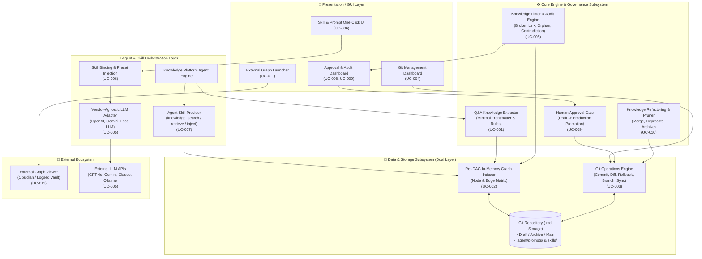
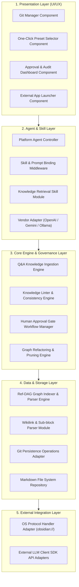

# Knowledge Platform Overall Architecture Specifications

> **Document ID**: `0816_knowledge_platform_architecture_spec`  
> **Date**: 2026-08-16  
> **Author**: Antigravity AI & Knowledge Architecture Team  
> **Related Use Case Document**: [.doc/0816_usecase_spec.md](file:///home/chaehwan/bifacewiki/bifacewiki/.doc/0816_usecase_spec.md)  
> **Related Requirements Document**: [.doc/0816_requirements_and_nfr_spec.md](file:///home/chaehwan/bifacewiki/bifacewiki/.doc/0816_requirements_and_nfr_spec.md)  
> **Status**: Approved Reference Architecture (Final Specification)  

---

## 1. Knowledge Platform Overall Architecture (전체 아키텍처)

### 1.1 아키텍처 개요 및 설계 철학
본 지식 플랫폼(Knowledge Platform)은 **"Human Knowledge(인간 지식)와 AI Knowledge(AI 지식)의 명확한 역할 분리 및 상호 보완적 공생"**을 핵심 철학으로 설계되었습니다. 

- **Dual-Layer Architecture (이중 레이어 아키텍처)**:
  - **Physical Layer (물리 저장소 레이어)**: DB 없이 파일 시스템 기반의 Git 저장소에 **"1개 파일 = 1개 원자적 주제(Atomic Knowledge Page)"** 단위의 Markdown 문서로 보존됩니다.
  - **Logical Layer (논리 그래프 레이어)**: 문서 내의 Frontmatter 메타데이터와 `[[Wikilinks]]` 파싱을 통해 형성되는 **Ref-DAG (Reference Directed Acyclic Graph)** 인덱스 체계입니다.
- **Human-AI Duality & Authority Boundary (주체성 및 권한 경계)**:
  - **Human Knowledge Broker (인간 중개자)**: 의도(Why), 가치 판단, 최종 승인 권한(Accountable)을 보유합니다.
  - **AI Knowledge Supporter (AI 조력자)**: 지식의 정형화, Wikilinks 연관 연결, Ref-DAG 유지, 24/7 지식 린팅(Linting) 및 수명주기 관리를 피로 없이 수행(Responsible)합니다.

### 1.2 End-to-End System Architecture (전체 아키텍처 다이어그램)

---

## 2. Knowledge Platform Module View (모듈 뷰)

지식 플랫폼의 모듈 구조는 관심사 분리(Separation of Concerns) 및 높은 확장성을 보장하기 위해 5개의 핵심 계층 모듈로 분류됩니다.

### 2.1 계층별 모듈 상세 규격

| 계층 (Layer) | 주요 모듈 (Module) | 핵심 역할 및 책임 (Responsibilities) | 관련 UC |
| :--- | :--- | :--- | :--- |
| **1. Presentation Layer** | `GitManagerComponent` | Git 저장소 상태 표시, Sync(Push/Pull) 제어, Diff 시각화 | UC-004 |
| | `PresetSelectorComponent` | `.agent/` 내 프롬프트/스킬 프리셋 렌더링 및 클릭 바인딩 이벤트 처리 | UC-006 |
| | `ApprovalDashboardComponent` | Draft 지식 검토 UI, Diff 비교, 린팅 이슈 확인 및 Approve/Reject 액션 처리 | UC-008, UC-009 |
| | `ExternalLauncherComponent` | external graph launcher 버튼 렌더링 및 OS URI scheme 호출 | UC-011 |
| **2. Agent & Skill Layer** | `AgentController` | 사용자 질의 처리, Agent 추론 루프 제어 및 도구 호출 조율 | UC-001, UC-007 |
| | `SkillBindingMiddleware` | 선택된 `SKILL.md` 및 System Prompt를 런타임 LLM 세션에 주입 | UC-006 |
| | `KnowledgeRetrievalSkill` | LLM의 Tool Call 요청을 받아 Ref-DAG 인덱스 기반 Context 조립 및 주입 | UC-007 |
| | `LLMVendorAdapter` | OpenAI, Gemini, Claude, Ollama 등의 규격 차이를 흡수하는 추상 어댑터 | UC-005 |
| **3. Core Engine Layer** | `KnowledgeIngestionEngine` | Q&A 대화 정제, 3대 단순 규칙 준수 Markdown 및 Minimal Frontmatter 생성 | UC-001 |
| | `KnowledgeLinterEngine` | 깨진 Wikilinks, Orphan Node, 스키마 오차, Contradiction 정적 린팅 | UC-008 |
| | `ApprovalGateManager` | Draft 문서의 lifecycle 제어 (`draft` -> `production`), 브랜치 병합 관리 | UC-009 |
| | `GraphRefactoringEngine` | 유사 노드 자동 통합(Merge), Stale Node 폐기(Deprecate/Archive) | UC-010 |
| **4. Data & Storage Layer** | `RefDAGIndexerEngine` | 마크다운 파일 파싱, Node & Edge 매트릭스 구성, 메모리 인덱스 관리 | UC-002 |
| | `WikilinkParser` | `[[Wikilinks]]` 및 `# Heading` 서브블록 파싱 | UC-002 |
| | `GitOperationsAdapter` | `git add/commit/push/pull/diff/revert` 등 low-level Git API 실행 | UC-003 |
| | `MarkdownRepository` | 로컬 디렉토리 마크다운 파일 CRUD 및 버전 파일 입출력 | UC-003 |
| **5. External Integration** | `OSProtocolAdapter` | `obsidian://open` 등 OS 레벨 프로토콜 핸들러 실행 | UC-011 |
| | `ExternalLLMClientSDK` | 외부 Vendor LLM REST/gRPC API 통신 처리 | UC-005 |

---

## 3. Use Case Specifications Overview (유스케이스 명세 연동)

> [!NOTE]
> 지식 플랫폼의 유스케이스 세부 명세서(UC-001 ~ UC-011)는 별도 확정 명세서인 **[.doc/0816_usecase_spec.md](file:///home/chaehwan/bifacewiki/bifacewiki/.doc/0816_usecase_spec.md)**로 분리 정의되어 있습니다.

### 3.1 아키텍처 연관 유스케이스 영역
- **Ingestion & Structure (UC-001, UC-002)**: Q&A 기반 원자적 지식 추출, Negative Knowledge 수집, Ref-DAG 인덱스 구축
- **Storage & Management (UC-003, UC-004)**: Git 영속화 어댑터, Git Management Web GUI
- **Platform & Agent (UC-005, UC-006, UC-007)**: Vendor-Agnostic LLM 어댑터, 원클릭 스킬 바인딩, Agent/Skill 지식 주입
- **Governance & Approval (UC-008, UC-009, UC-010)**: 24/7 지식 린터, 인간 검증 관문, 지식 리팩토링 및 수명주기
- **Exploration (UC-011)**: Obsidian/Logseq 외부 그래프 뷰어 원클릭 연동

상세한 각 유스케이스별 조건, 기본/대안 흐름, 비기능 요구사항 및 추적성 매트릭스는 [.doc/0816_usecase_spec.md](file:///home/chaehwan/bifacewiki/bifacewiki/.doc/0816_usecase_spec.md)를 참조하십시오.

---

## 4. 종합 결언 및 향후 실행 과제 (Summary & Next Steps)

### 4.1 향후 실행 과제
1. 본 명세서 및 [.doc/0816_usecase_spec.md](file:///home/chaehwan/bifacewiki/bifacewiki/.doc/0816_usecase_spec.md) 기반 **YAML Frontmatter 표준 스키마 및 Linter 검증 파서 개발**.
2. **Knowledge Platform Agent Skill 정의 파일 (`SKILL.md`)** 및 Prompt 템플릿 패키징.
3. Git Operations 어댑터 및 **Web UI (Git Sync Dashboard & Approval Gate Widget) 구축**.
