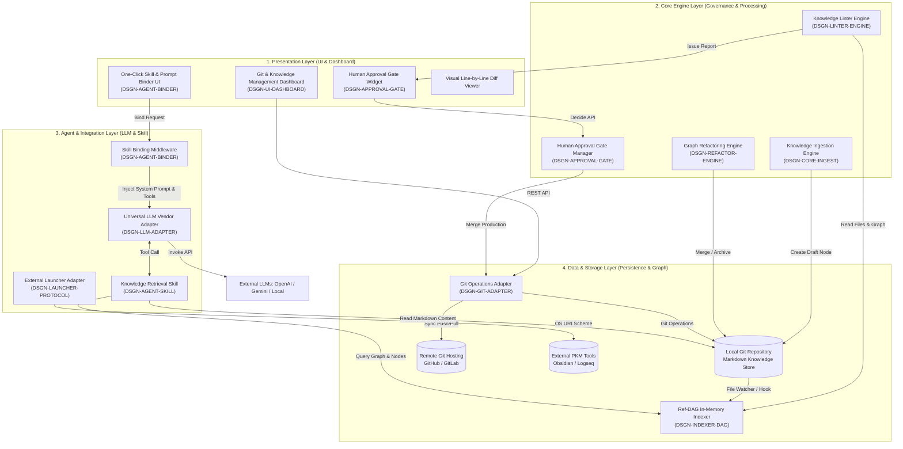
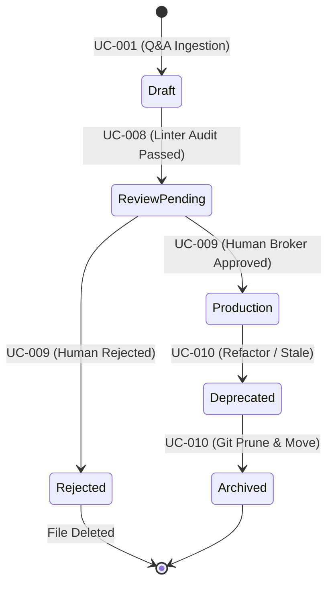
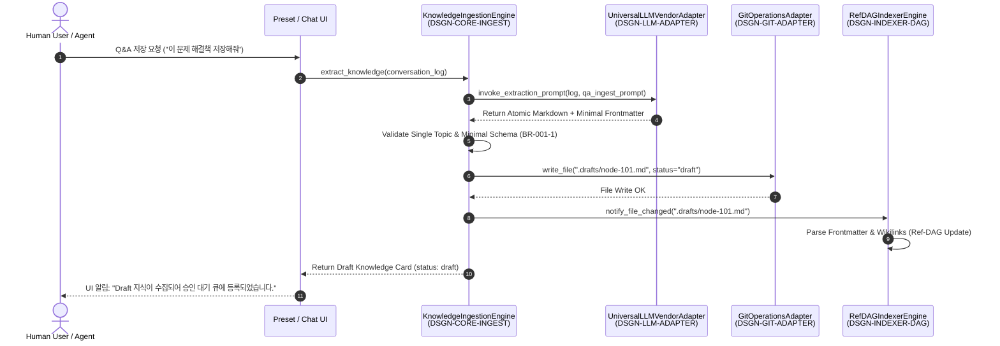
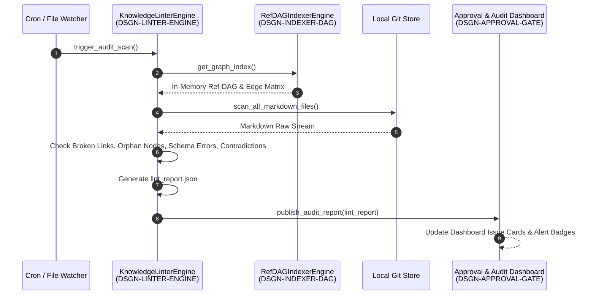
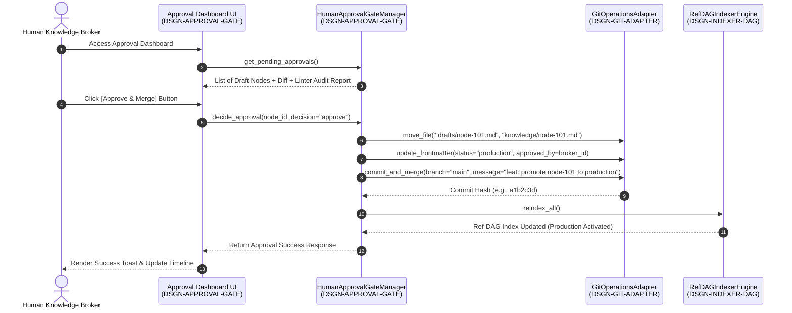
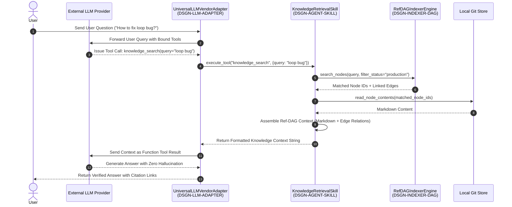

# Knowledge Platform Overall Architecture & Module View Specification (전체 아키텍처 및 모듈 뷰 명세서)

> **Document ID**: `0816_knowledge_platform_architecture_spec`  
> **Date**: 2026-08-16  
> **Author**: Antigravity AI & Knowledge Architecture Team (Architect, PO, Developer, QA Roles)  
> **Related Use Case Specification**: [.doc/0816_usecase_spec.md](file:///home/chaehwan/bifacewiki/bifacewiki/.doc/0816_usecase_spec.md)  
> **Related Requirements Specification**: [.doc/0816_requirements_and_nfr_spec.md](file:///home/chaehwan/bifacewiki/bifacewiki/.doc/0816_requirements_and_nfr_spec.md)  
> **Status**: Approved Architecture Standard (Final Specification)  

---

## 1. 개요 및 전체 아키텍처 (Overall Architecture)

### 1.1 아키텍처 비전 및 핵심 설계 원칙

Knowledge Platform은 Human Knowledge와 AI Knowledge를 이원화하여 관리하고, 지식의 수집·구조화·영속화·제어 UI·플랫폼 독립성·에이전트 연동·탐색·거버넌스·승인 관문·수명주기 관리·외부 시각화를 전담하는 통합 지식 에코시스템입니다. 

본 아키텍처는 다음 3가지 핵심 원칙을 준수합니다:

1. **Dual-Layer Architecture (이중 레이어 아키텍처)**:
   - **Physical Storage Layer**: RDBMS/NoSQL 데이터베이스 없이 표준 마크다운 파일시스템과 Git 버전 제어를 단일 진실 원천(Source of Truth)으로 사용합니다.
   - **Logical Graph Layer**: YAML Frontmatter 및 `[[Wikilinks]]` 구문을 파싱하여 런타임에 메모리 상에 최적화된 **Ref-DAG (Reference Directed Acyclic Graph)** 지식 그래프 인덱스를 유지합니다.
2. **Atomic Knowledge & Minimal Schema Pattern**:
   - 1개 마크다운 문서당 1개의 원자적(Atomic) 주제만 포함하도록 제한(`NFR-MAINT-02`)하며, 최소한의 Frontmatter 메타데이터(`id`, `title`, `type`, `status`, `author_type`)만을 부여하여 작성 오버헤드와 파싱 복잡도를 최적화합니다.
3. **Vendor-Agnostic & Agent-Centric Skill Interface**:
   - RAG 파이프라인의 하드코딩을 배제하고, `.agent/skills/` 및 `prompts/`에 정의된 원클릭 주입 가능한 표준 Skill 규약(`knowledge_search`, `knowledge_retrieve`, `knowledge_context_inject`)을 매개로 LLM 벤더(OpenAI, Gemini, Claude, Local Ollama)에 관계없이 정밀 조립된 지식을 주입합니다.

---

### 1.2 전체 시스템 아키텍처 다이어그램 (System Architecture Diagram)



---

### 1.3 4대 구조적 영역 (Layered Architecture Breakdown)

#### A. Presentation Layer (제어 UI 영역)
- **Git & Knowledge Management Dashboard (`DSGN-UI-DASHBOARD`)**: 저장소 상태(Staged/Unstaged), 커밋 타임라인, 동기화 진행바, Visual Line-by-Line Diff 및 롤백 UI를 제공합니다 (`UC-004`).
- **One-Click Skill Binding UI (`DSGN-AGENT-BINDER`)**: 프롬프트를 대화창에 수동으로 복사하지 않고 프리셋 카드를 원클릭 선택하여 세션에 바인딩합니다 (`UC-006`).
- **Human Approval & Audit Dashboard (`DSGN-APPROVAL-GATE`)**: AI가 정제한 Draft 문서, 원본 Q&A, 린팅 검사 리포트를 비교하여 승인/반려/수정요청 결정을 수행합니다 (`UC-009`).

#### B. Core Engine Layer (핵심 정제 및 거버넌스 엔진 영역)
- **Knowledge Ingestion Engine (`DSGN-CORE-INGEST`)**: Q&A 대화를 파싱하여 긍정 해결책(`type: solution`) 및 안티패턴/실패 경험(`type: negative_knowledge`)을 1개의 원자적 마크다운 문서로 정제합니다 (`UC-001`).
- **Knowledge Linter Engine (`DSGN-LINTER-ENGINE`)**: 깨진 링크(Broken Link), 고립 노드(Orphan Node), YAML 스키마 오차, 상충 지식(Contradiction)을 24/7 자동 정적 스캔하여 Audit 리포트를 생성합니다 (`UC-008`).
- **Human Approval Gate Manager (`DSGN-APPROVAL-GATE`)**: AI 생성 지식(`author_type: ai_generated`)을 승인 전까지 프로덕션에 노출하지 않고 `draft`로 격리한 후 승인 시 `main` 브랜치에 병합 커밋합니다 (`UC-009`).
- **Graph Refactoring Engine (`DSGN-REFACTOR-ENGINE`)**: 유사도 0.90 이상의 중복 파편화 노드를 통합(Merge)하고 참조 링크를 자동 리다이렉트하며 낡은 지식을 Archive 영역으로 폐기합니다 (`UC-010`).

#### C. Data & Storage Layer (영속성 및 그래프 인덱스 영역)
- **Ref-DAG In-Memory Indexer Engine (`DSGN-INDEXER-DAG`)**: Frontmatter 및 `[[Wikilinks]]`를 AST 파싱하여 노드와 directional 엣지 매트릭스(Ref-DAG)를 구축하고 순환 참조(Circular Dependency)를 검증합니다 (`UC-002`).
- **Git Operations Adapter (`DSGN-GIT-ADAPTER`)**: Git CLI 및 Libgit2 wrapper를 제공하여 file commit, diff comparison, revert rollback, remote push/pull을 동기화합니다 (`UC-003`).

#### D. Agent & Integration Layer (에이전트 및 외부 연동 영역)
- **Universal LLM Vendor Adapter (`DSGN-LLM-ADAPTER`)**: OpenAI, Gemini, Claude, Local Ollama 등 벤더별 REST/gRPC 호출 차이를 단일 인터페이스로 추상화합니다 (`UC-005`).
- **Skill Binding Middleware (`DSGN-AGENT-BINDER`)**: `.agent/skills/`의 YAML Frontmatter와 Tool Schema를 로딩하여 LLM 세션 System Prompt 및 Tool List로 동적 주입합니다 (`UC-006`).
- **Knowledge Retrieval Skill (`DSGN-AGENT-SKILL`)**: LLM의 `knowledge_search()`, `knowledge_retrieve()` Tool Call 요구 시 Ref-DAG 그래프를 탐색하여 최적의 Markdown Context를 조립하여 반환합니다 (`UC-007`).
- **External Launcher Adapter (`DSGN-LAUNCHER-PROTOCOL`)**: OS URI Scheme (`obsidian://open`)을 호출하여 Obsidian/Logseq vault에서 그래프 시각화를 구동합니다 (`UC-011`).

---

### 1.4 지식 거버넌스 및 브랜치/디렉토리 수명주기 전이 모델 (PO 관점)

Model Collapse 및 지식 오염을 방지하기 위해 지식 생명주기는 물리적 디렉토리 구조 및 Git 브랜치 거버넌스와 1:1로 매핑됩니다 (`NFR-SEC-01`).



#### 물리 디렉토리 및 Git 브랜치 분리 규약

| 지식 상태 (`status`) | 물리 디렉토리 위치 | Git 브랜치 | 권한 및 LLM 주입 여부 |
| :--- | :--- | :--- | :--- |
| `draft` | `.drafts/` | feature/draft-* 또는 working branch | **프로덕션 LLM 주입 불가** (`NFR-SEC-01`). 오직 검토용 |
| `review_pending` | `.drafts/` | working branch | Linter 정합성 검사 통과, 승인 관문 대기 중 |
| `production` | `knowledge/` | `main` branch | **승인 완료된 단일 진실 원천 (Source of Truth)**. LLM Context 주입 대상 |
| `deprecated` | `archive/deprecated/` | `main` branch | 대체된 구 지식. 주입 시 경고 뱃지 출력 |
| `archived` | `archive/expired/` | `main` branch | 완전히 폐기된 이력 보존용 지식 |

---

### 1.5 Ref-DAG 그래프 모델링 및 순환 방지 알고리즘 (Architect 관점)

Ref-DAG (Reference Directed Acyclic Graph)는 노드 간 참조 관계를 의존성 방향 그래프로 유지하며, 순환 참조(Circular Dependency)가 존재하지 않는 방침을 보장합니다 (`NFR-RELI-03`).

#### 노드(Node) 및 엣지(Edge) 계층 모델링 (Item 4: Hierarchical Sub-node DAG Data Model)

지식 문서 파일 단위(File-level)와 문서 내부 Heading 절 단위(Sub-block level)의 입도(Granularity) 불일치를 해결하기 위해 계층적 노드 및 엣지 체계를 정의합니다:

- **Primary Node $V_{\text{file}}$**: 파일명 또는 Frontmatter `id`와 1:1 대칭되는 마크다운 지식 파일 (`node-id`).
- **Sub-block Node $V_{\text{subblock}}$**: 파일 내부의 Heading (`#`, `##`, `###`) 섹션을 상위 노드 하위의 독립 서브 노드로 식별하는 계층 ID 체계 (`node-id#heading-slug`).
- **Edge $E$ 계층 구별**:
  - `references`: 본문 내 `[[Wikilinks]]` 또는 `[[node-id#heading-slug]]`에 의한 참조 관계.
  - `depends_on`: Frontmatter `prerequisite` 또는 섹션 간 선행 의존 관계 ($v_i \rightarrow v_j$).
  - `parent_of` / `child_of`: Primary File Node와 Sub-block Node 간의 상하 계층 구조 관계.
  - `replaces`: Frontmatter `supersedes` 필드에 명시된 대체 관계.
  - `semantically_related`: 시맨틱 유사도 $\ge 0.85$ 인 지식 간 무방향 연관 관계.

#### Persistent Graph Cache Layer Architecture (Item 1: 대규모 확장성 영속화 인덱스)

5,000 ~ 50,000개 이상의 대용량 마크다운 지식 파일 존재 시 RAM 상의 단일 인덱스 구축 지연(Cold Start > 30s) 문제를 해결하기 위해 **2-Tier Graph Caching Strategy**를 적용합니다:

1. **Tier-1 In-Memory Hot Index**: 서브밀리초(< 1ms) 탐색을 위한 메모리 그래프 데이터 구조체.
2. **Tier-2 Persistent Graph Store (Embedded SQLite / RocksDB)**:
   - `nodes` (id, path, hash, type, status, updated_at), `edges` (source, target, type), `sub_blocks` (id, parent_id, slug) 테이블 관리.
   - **Incremental Graph Sync (증분 동기화)**: 시스템 기동 시 및 파일 변경 시 `content_hash` (MD5/SHA256) 비교를 통해 변경된 파일만 차분 파싱하여 Cold Start 지연 시간을 **< 500ms**로 단축합니다.

#### File Watcher Debounce Sliding Window Event Queue (Item 5: 500ms 버퍼)

대량 리팩토링(`DSGN-REFACTOR-ENGINE`)이나 `git checkout`/`git pull` 시 초당 수백 건의 파일 변경 알림이 발생하는 이벤트 스톰(Event Storm) 현상을 차단합니다:

- `FileWatcherThrottler` 미들웨어가 500ms Sliding Window Debounce 큐를 유지합니다.
- 500ms 동안 추가 이벤트 발생이 없을 때 집계된 `BatchFileChangeEvent(file_paths: List[str])` 건만을 `RefDAGIndexerEngine`으로 단 1회 차분 갱신 요청을 전달합니다.

#### 계층적 순환 참조 방지 알고리즘 (Kahn's Algorithm based Cycle Detection)

신규 엣지 $e = (u, v)$ 추가 시 인덱서는 **Kahn의 위상 정렬(Topological Sort) 알고리즘**을 Primary Node 및 Sub-block Node 레벨에 동시 적용하여 순환(Cycle) 여부를 검증합니다.

$$\text{In-Degree Count} = 0 \text{ 인 노드가 존재하지 않거나, 방문 노드 수 } < |V| \implies \text{Cycle Detected}$$

```python
def validate_dag_cycle_prevention(nodes: Dict[str, Node], edges: List[Edge], new_edge: Edge) -> bool:
    # 1. Temporary Graph Construction with proposed new edge (supports file & sub-block nodes)
    adj_list = defaultdict(set)
    in_degree = defaultdict(int)
    all_node_ids = set(nodes.keys())
    
    for edge in edges + [new_edge]:
        adj_list[edge.source].add(edge.target)
        in_degree[edge.target] += 1
        all_node_ids.add(edge.source)
        all_node_ids.add(edge.target)

    # 2. Queue initialization with nodes having in-degree == 0
    queue = deque([node_id for node_id in all_node_ids if in_degree[node_id] == 0])
    visited_count = 0

    # 3. Kahn's Topological Sort Traversal
    while queue:
        curr = queue.popleft()
        visited_count += 1
        for neighbor in adj_list[curr]:
            in_degree[neighbor] -= 1
            if in_degree[neighbor] == 0:
                queue.append(neighbor)

    # 4. Cycle Detection Check: If visited count != total nodes, a cycle exists!
    if visited_count != len(all_node_ids):
        raise CircularDependencyException(
            f"Circular reference detected when adding link from '{new_edge.source}' to '{new_edge.target}'."
        )
    return True
```

---

### 1.6 런타임 동적 시퀀스 플로우 (Mermaid Sequence Diagrams)

#### Sequence Flow 1: Q&A 지식 추출 및 Atomic 노드 생성 (`UC-001`)



#### Sequence Flow 2: 24/7 지식 린팅 및 정합성 검사 (`UC-008`)



#### Sequence Flow 3: 인간 검증 및 승인 관문 (`UC-009`)



#### Sequence Flow 4: Agent/Skill 기반 LLM 지식 제공 및 Context 주입 (`UC-007`)



---

## 2. 모듈 뷰 (Module View & Component Specification)

### 2.1 전체 모듈 구성도 및 `DSGN` ID 추적성 매트릭스

| 모듈 ID | 클래스/모듈명 | 소속 계층 | 연관 유스케이스 | 추적 요구사항 | 추적 테스트 |
| :--- | :--- | :--- | :--- | :--- | :--- |
| **DSGN-CORE-INGEST** | `KnowledgeIngestionEngine` | Core Engine | `UC-001` | `REQ-INGEST-01`, `REQ-INGEST-02` | `TEST-UC001-01`, `TEST-UC001-02` |
| **DSGN-INDEXER-DAG** | `RefDAGIndexerEngine` | Data & Storage | `UC-002` | `REQ-GRAPH-01`, `REQ-GRAPH-02` | `TEST-UC002-01` |
| **DSGN-GIT-ADAPTER** | `GitOperationsAdapter` | Data & Storage | `UC-003` | `REQ-STORAGE-01`, `REQ-STORAGE-02` | `TEST-UC003-01` |
| **DSGN-UI-DASHBOARD** | `GitManagementDashboard` | Presentation | `UC-004` | `REQ-UI-GIT-01`, `REQ-UI-GIT-02` | `TEST-UC004-01` |
| **DSGN-LLM-ADAPTER** | `UniversalLLMVendorAdapter` | Agent & Skill | `UC-005` | `REQ-PLATFORM-01` | `TEST-UC005-01` |
| **DSGN-AGENT-BINDER** | `SkillBindingMiddleware` | Agent & Skill | `UC-006` | `REQ-AGENT-BIND-01` | `TEST-UC006-01` |
| **DSGN-AGENT-SKILL** | `KnowledgeRetrievalSkill` | Agent & Skill | `UC-007` | `REQ-RETRIEVAL-01` | `TEST-UC007-01` |
| **DSGN-LINTER-ENGINE** | `KnowledgeLinterEngine` | Core Engine | `UC-008` | `REQ-GOV-LINT-01` | `TEST-UC008-01` |
| **DSGN-APPROVAL-GATE** | `HumanApprovalGateManager` | Core Engine | `UC-009` | `REQ-GOV-APPROVE-01` | `TEST-UC009-01` |
| **DSGN-REFACTOR-ENGINE**| `GraphRefactoringEngine` | Core Engine | `UC-010` | `REQ-LIFECYCLE-01` | `TEST-UC010-01` |
| **DSGN-LAUNCHER-PROTOCOL**| `ExternalLauncherAdapter` | Agent & Integration| `UC-011` | `REQ-INTEG-OBS-01` | `TEST-UC011-01` |

---

### 2.2 Presentation Layer 모듈 상세 사양

#### DSGN-UI-DASHBOARD: `GitManagementDashboard`
- **책임**: CLI 없이 Web UI 상에서 Git 저장소 초기화, 동기화(Push/Pull), 커밋 타임라인, Visual Line-by-Line Diff 및 원클릭 Rollback UI를 제공함 (`UC-004`).
- **주요 메서드 및 인터페이스**:
  - `render_status_widget(repo_path: str) -> JSX.Element`
  - `render_timeline_widget(history: List[CommitDTO]) -> JSX.Element`
  - `render_diff_modal(commit_hash_a: str, commit_hash_b: str) -> JSX.Element`
- **REST API 엔드포인트**: `GET /api/v1/git/status`, `GET /api/v1/git/history`

---

### 2.3 Core Engine Layer 모듈 상세 사양

#### DSGN-CORE-INGEST: `KnowledgeIngestionEngine`
- **책임**: Q&A 세션을 파싱하여 Atomic Knowledge 문서 및 Minimal Frontmatter를 생성하고, 실패 경험은 `type: negative_knowledge`로 분류하여 Draft 디렉토리에 저장함 (`UC-001`).
- **주요 메서드 및 인터페이스**:
  - `extract_from_conversation(session_log: str, hints: List[str]) -> IngestionResultDTO`
  - `parse_frontmatter_schema(raw_md: str) -> FrontmatterDTO`
  - `validate_atomic_constraint(content: str) -> bool`
- **REST API 엔드포인트**: `POST /api/v1/knowledge/extract`

#### DSGN-LINTER-ENGINE: `KnowledgeLinterEngine`
- **책임**: 깨진 참조(Broken Link), 고립 노드(Orphan Node), Frontmatter 스키마 에러, 180일 이상 Stale Node, 상충 지식을 정적 스캔하여 Audit 리포트 발행 (`UC-008`).
- **주요 메서드 및 인터페이스**:
  - `run_audit_scan(repo_path: str) -> LintAuditReportDTO`
  - `detect_broken_links(graph: RefDAGGraph) -> List[BrokenLinkIssue]`
  - `detect_orphan_nodes(graph: RefDAGGraph) -> List[str]`
- **REST API 엔드포인트**: `POST /api/v1/audit/lint`

#### DSGN-APPROVAL-GATE: `HumanApprovalGateManager`
- **책임**: Draft 지식 노드의 인간 중개자 승인/반려/수정요청 결정을 처리하고, 승인 시 `status: production` 전환 및 Git `main` 병합 커밋을 수행함 (`UC-009`).
- **주요 메서드 및 인터페이스**:
  - `get_pending_approvals() -> List[PendingApprovalNodeDTO]`
  - `decide_approval(decision_dto: ApprovalDecisionDTO) -> ApprovalResultDTO`
- **REST API 엔드포인트**: `GET /api/v1/approval/pending`, `POST /api/v1/approval/decide`

#### DSGN-REFACTOR-ENGINE: `GraphRefactoringEngine`
- **책임**: 유사도 $\ge 0.90$ 인 파편화 노드를 원자적 1개 노드로 병합(Merge)하고, 기존 Wikilink 참조를 자동 리다이렉트 처리하며 낡은 지식을 Archive 처리함 (`UC-010`).
- **주요 메서드 및 인터페이스**:
  - `propose_merge_plan(candidate_ids: List[str]) -> RefactorPlanDTO`
  - `execute_merge(plan_id: str) -> MergeResultDTO`
  - `prune_deprecated_nodes(target_ids: List[str]) -> PruneResultDTO`
- **REST API 엔드포인트**: `POST /api/v1/refactor/merge`, `POST /api/v1/refactor/prune`

---

### 2.4 Data & Storage Layer 모듈 상세 사양

#### DSGN-INDEXER-DAG: `RefDAGIndexerEngine`
- **책임**: Frontmatter, 본문 `[[Wikilinks]]`, 및 Sub-block Section(`node-id#heading-slug`)을 파싱하여 In-Memory 및 SQLite Persistent Graph Cache (Tier-2) 인덱스를 구축하고, 500ms Sliding Window Debounce 큐 및 Kahn's algorithm 계층적 순환 참조 감지를 수행함 (`UC-002`, `NFR-PERF-02`, `NFR-RELI-03`).
- **주요 메서드 및 인터페이스**:
  - `reindex_incremental(changed_files: List[str]) -> RefDAGGraph` (증분 파싱 및 SQLite 영속 캐시 갱신)
  - `debounce_file_events(event_batch: List[FileEvent]) -> None` (500ms 디바운싱 이벤트 슬라이딩 큐)
  - `parse_sub_blocks(markdown_content: str, parent_id: str) -> List[SubBlockNode]` (Heading 단 서브노드 파싱)
  - `get_related_subgraph(node_id: str, depth: int, include_subblocks: bool = True) -> SubGraphDTO`
  - `validate_dag_cycle(new_edge: Edge) -> bool`
- **REST API 엔드포인트**: `GET /api/v1/graph/nodes`, `GET /api/v1/graph/edges`

#### DSGN-GIT-ADAPTER: `GitOperationsAdapter`
- **책임**: 로컬/원격 Git 명령어(`add`, `commit`, `push`, `pull`, `diff`, `revert`)를 캡슐화하여 파일 기반 버전 제어 영속성을 보장함 (`UC-003`).
- **주요 메서드 및 인터페이스**:
  - `commit(file_paths: List[str], message: str, author: str) -> str`
  - `get_diff(commit_a: str, commit_b: str) -> DiffResultDTO`
  - `rollback(commit_hash: str) -> bool`
  - `sync_remote(remote_name: str, branch: str) -> SyncStatusDTO`
- **REST API 엔드포인트**: `POST /api/v1/git/commit`, `POST /api/v1/git/sync`, `POST /api/v1/git/rollback`

---

### 2.5 Agent & Integration Layer 모듈 상세 사양

#### DSGN-LLM-ADAPTER: `UniversalLLMVendorAdapter`
- **책임**: OpenAI GPT, Google Gemini, Anthropic Claude, Local Ollama의 API 호출 규격을 단일 인터페이스로 추상화함 (`UC-005`).
- **주요 메서드 및 인터페이스**:
  - `invoke(request: LLMInvokeRequestDTO) -> LLMInvokeResponseDTO`
  - `switch_vendor(vendor_code: str, config: VendorConfigDTO) -> bool`
- **REST API 엔드포인트**: `PUT /api/v1/settings/llm-vendor`

#### DSGN-AGENT-BINDER: `SkillBindingMiddleware`
- **책임**: `.agent/skills/` 및 `prompts/` 내 정의 템플릿을 읽어 LLM 대화 세션의 System Prompt 및 Function Calling Tool Schema로 바인딩함 (`UC-006`).
- **주요 메서드 및 인터페이스**:
  - `bind_skill(session_id: str, preset_id: str) -> BoundSessionDTO`
  - `load_skill_definition(skill_path: str) -> SkillDefinitionDTO`
- **REST API 엔드포인트**: `POST /api/v1/agent/bind-skill`

#### DSGN-AGENT-SKILL: `KnowledgeRetrievalSkill`
- **책임**: LLM의 `knowledge_search()`, `knowledge_retrieve()` Tool Call 요청을 수신하여 Ref-DAG 인덱스를 탐색하고 최적의 Markdown Context를 조립 주입함 (`UC-007`).
- **주요 메서드 및 인터페이스**:
  - `knowledge_search(query: str, filter_tags: List[str]) -> List[NodeSummaryDTO]`
  - `knowledge_retrieve(node_id: str, depth: int) -> KnowledgeContextDTO`
  - `knowledge_context_inject(context: KnowledgeContextDTO) -> str`
- **Agent Tool Names**: `knowledge_search`, `knowledge_retrieve`, `knowledge_context_inject`

#### DSGN-LAUNCHER-PROTOCOL: `ExternalLauncherAdapter`
- **책임**: OS URI Scheme (`obsidian://open?vault=...&file=...`)을 호출하여 등록된 외부 시각화 툴(Obsidian/Logseq)을 구동함 (`UC-011`).
- **주요 메서드 및 인터페이스**:
  - `launch_external_tool(tool_type: str, vault_path: str, target_file: str) -> bool`
- **REST API 엔드포인트**: `GET /api/v1/external/launch`

---

### 2.6 LLM Service Skill 제공 타당성 평가 매트릭스 (LLM Skill Appropriateness Matrix)

플랫폼의 각 모듈별 기능에 대해 LLM 서비스의 **Agent Skill (Tool Calling)**로 노출하는 것이 타당한 기능과, **시스템 내부 엔진 / 백그라운드 / 보안 관문 / 프론트엔드 전용**으로 유지해야 하는 기능을 분류한 표준 규격입니다.

| 모듈 ID | 세부 기능 / 메서드 | LLM Skill 제공 타당성 | 바인딩 스킬명 (Bound Skill) | 분류 사유 및 시스템 경계 규정 |
| :--- | :--- | :---: | :--- | :--- |
| **DSGN-CORE-INGEST** | Q&A 지식 추출 및 Atomic 작성 | **O (Skill 타당)** | `knowledge_extract` | 대화 맥락 인지, 핵심 요약, Negative Knowledge 분류 등 AI 추론 필수 |
| | YAML Frontmatter 정적 파싱 | **X (시스템 전용)** | - | 정적 텍스트 정규식 파서. LLM 추론 불필요 |
| **DSGN-INDEXER-DAG** | 연관 그래프 서브트리 탐색 | **O (Skill 타당)** | `knowledge_search` | LLM 질의 연관 지식 노드 및 Edge 탐색 도구 |
| | SQLite 캐시 증분 파싱 | **X (시스템 전용)** | - | 파일 변경 시 동작하는 백그라운드 DB 동기화 데몬 |
| | inotify 500ms 디바운싱 | **X (시스템 전용)** | - | OS 레벨 슬라이딩 윈도우 파일 이벤트 버퍼 |
| | Kahn's DAG 순환 참조 검증 | **X (시스템 전용)** | - | 정적 그래프 수학적 검증 엔진 하드코딩 로직 |
| **DSGN-GIT-ADAPTER** | 지식 변경 원자적 Git 커밋 | **O (Skill 타당)** | `knowledge_git_commit` | Agent가 지식 생성/수정 후 구조화 커밋 메시지 작성 발송 |
| | Remote Sync (Push/Pull) | **X (시스템 전용)** | - | SSH/Keychain 인증 기반 대시보드 및 백그라운드 통신 |
| **DSGN-UI-DASHBOARD** | Git GUI 상태 및 Visual Diff | **X (시스템 전용)** | - | React/Web UI 시각화 렌더링 전용 |
| **DSGN-LLM-ADAPTER** | LLM API 통신 및 벤더 전환 | **X (시스템 전용)** | - | 백엔드 어댑터 코어 및 관리자 설정 전용 |
| **DSGN-AGENT-BINDER** | 런타임 스킬 동적 바인딩 | **O (Skill 타당)** | `agent_bind_skill` | 대화 맥락에 맞춰 Agent가 필요한 스킬 셋 주입 요청 |
| **DSGN-AGENT-SKILL** | 지식 노드 검색 / 상세 조회 / Context 주입 | **O (Skill 타당)** | `knowledge_search`<br/>`knowledge_retrieve`<br/>`knowledge_context_inject` | LLM Tool Calling 기반 정밀 지식 탐색 및 프롬프트 주입 스킬 3종 |
| **DSGN-LINTER-ENGINE**| 지식 린팅 및 정합성 검사 | **O (Skill 타당)** | `knowledge_audit_scan` | 깨진 링크, Orphan Node, 지식 간 모순 탐지 리포트 작성 |
| **DSGN-APPROVAL-GATE**| 승인 대기 노드/Diff 목록 조회 | **O (Skill 타당)** | `knowledge_get_pending_approvals` | Agent 또는 인간 중개자가 승인 대기 큐 검토 시 활용 |
| | **지식 승인 최종 결정 (`decide_approval`)** | **X (Skill 엄격금지)** | - | **`NFR-SEC-01` 제약**: AI 자가 승인(Self-Approval) 시 Model Collapse 발생. 오직 인간 중개자 UI 전용! |
| **DSGN-REFACTOR-ENGINE**| 파편화 노드 통합(Merge) 플랜 제안 | **O (Skill 타당)** | `knowledge_propose_merge` | 중복 지식 의미 분석 후 통합 리팩토링 안 작성 |
| | 리팩토링 실행 / Archive 이관 | **X (시스템 전용)** | - | 승인 완료 후 백엔드 파일 이동/커밋 일괄 실행 로직 |
| **DSGN-LAUNCHER-PROTOCOL**| Obsidian OS URI Scheme 구동 | **X (시스템 전용)** | - | 클라이언트 OS 프로토콜 연동 (Web UI 버튼 전용) |

---

## 3. API 및 데이터 전송 객체 (REST API & DTO Specifications)

### 3.1 REST API 엔드포인트 전체 목록

| Method | Endpoint Path | 담당 모듈 | 설명 |
| :--- | :--- | :--- | :--- |
| `POST` | `/api/v1/knowledge/extract` | `DSGN-CORE-INGEST` | Q&A 대화 기반 Atomic Markdown 추출 및 Draft 저장 |
| `GET` | `/api/v1/graph/nodes` | `DSGN-INDEXER-DAG` | Ref-DAG 전체 노드 목록 조회 |
| `GET` | `/api/v1/graph/edges` | `DSGN-INDEXER-DAG` | Ref-DAG 노드 간 Edge 참조 매트릭스 조회 |
| `POST` | `/api/v1/git/commit` | `DSGN-GIT-ADAPTER` | 지식 파일 변경 사항 Local Git 커밋 |
| `POST` | `/api/v1/git/sync` | `DSGN-GIT-ADAPTER` | Remote Repo와 Git Push/Pull 동기화 |
| `POST` | `/api/v1/git/rollback` | `DSGN-GIT-ADAPTER` | 특정 Past Commit 시점으로 지식 Rollback |
| `GET` | `/api/v1/git/status` | `DSGN-UI-DASHBOARD` | 저장소 변경 파일 현황 및 Sync Status 조회 |
| `PUT` | `/api/v1/settings/llm-vendor` | `DSGN-LLM-ADAPTER` | 활성 LLM 공급자(OpenAI/Gemini/Ollama) 전환 |
| `POST` | `/api/v1/agent/bind-skill` | `DSGN-AGENT-BINDER` | UI 원클릭 선택 프롬프트/스킬 세션 바인딩 |
| `POST` | `/api/v1/audit/lint` | `DSGN-LINTER-ENGINE` | 전체 지식 저장소 24/7 자동 린팅 검사 실행 |
| `GET` | `/api/v1/approval/pending` | `DSGN-APPROVAL-GATE` | 인간 승인 대기 지식 목록 조회 |
| `POST` | `/api/v1/approval/decide` | `DSGN-APPROVAL-GATE` | 인간 중개자의 Approve / Reject / Revision 결정 |
| `POST` | `/api/v1/refactor/merge` | `DSGN-REFACTOR-ENGINE` | 파편화 유사 노드 통합(Merge) 수행 |
| `POST` | `/api/v1/refactor/prune` | `DSGN-REFACTOR-ENGINE` | Stale/Deprecated 노드 Archive 이관 |
| `GET` | `/api/v1/external/launch` | `DSGN-LAUNCHER-PROTOCOL`| OS URI Scheme 호출하여 Obsidian 뷰어 실행 |

---

### 3.2 핵심 DTO JSON Schemas (Developer Implementation Schemas)

#### 1. Ingestion Request DTO (`POST /api/v1/knowledge/extract`)
```json
{
  "$schema": "http://json-schema.org/draft-07/schema#",
  "title": "KnowledgeExtractRequestDTO",
  "type": "object",
  "properties": {
    "conversation_session_id": { "type": "string" },
    "raw_conversation_log": { "type": "string" },
    "classification_hints": {
      "type": "array",
      "items": { "type": "string" }
    }
  },
  "required": ["conversation_session_id", "raw_conversation_log"]
}
```

#### 2. Ingestion Response DTO
```json
{
  "$schema": "http://json-schema.org/draft-07/schema#",
  "title": "KnowledgeExtractResponseDTO",
  "type": "object",
  "properties": {
    "node_id": { "type": "string" },
    "file_path": { "type": "string" },
    "frontmatter": {
      "type": "object",
      "properties": {
        "id": { "type": "string" },
        "title": { "type": "string" },
        "type": { "type": "string", "enum": ["concept", "solution", "negative_knowledge", "architecture"] },
        "status": { "type": "string", "enum": ["draft"] },
        "author_type": { "type": "string", "enum": ["ai_generated", "human_authored"] }
      },
      "required": ["id", "title", "type", "status", "author_type"]
    },
    "extracted_markdown": { "type": "string" }
  },
  "required": ["node_id", "file_path", "frontmatter", "extracted_markdown"]
}
```

#### 3. Human Approval Decision DTO (`POST /api/v1/approval/decide`)
```json
{
  "$schema": "http://json-schema.org/draft-07/schema#",
  "title": "ApprovalDecisionDTO",
  "type": "object",
  "properties": {
    "node_id": { "type": "string" },
    "decision": { "type": "string", "enum": ["approve", "reject", "request_revision"] },
    "broker_id": { "type": "string" },
    "review_note": { "type": "string" }
  },
  "required": ["node_id", "decision", "broker_id"]
}
```

#### 4. Lint Audit Report DTO (`POST /api/v1/audit/lint`)
```json
{
  "$schema": "http://json-schema.org/draft-07/schema#",
  "title": "LintAuditReportDTO",
  "type": "object",
  "properties": {
    "scan_timestamp": { "type": "string", "format": "date-time" },
    "total_nodes_scanned": { "type": "integer" },
    "broken_links": {
      "type": "array",
      "items": {
        "type": "object",
        "properties": {
          "source_node_id": { "type": "string" },
          "missing_target_link": { "type": "string" }
        }
      }
    },
    "orphan_nodes": {
      "type": "array",
      "items": { "type": "string" }
    },
    "stale_nodes": {
      "type": "array",
      "items": { "type": "string" }
    }
  },
  "required": ["scan_timestamp", "total_nodes_scanned", "broken_links", "orphan_nodes"]
}
```

---

## 4. NFR 및 보안/격리 구현 아키텍처 (Non-Functional & Security Architecture)

### 4.1 AI 지식 승인 권한 격리 (Model Collapse 예방: `NFR-SEC-01`)

- **원칙**: AI가 자동 추출한 지식(`author_type: ai_generated`)이 인간 중개자의 검증 없이 프로덕션 LLM 세션에 주입될 경우, 환각 지식이 재학습/재주입되어 지식 저장소가 오염되는 Model Collapse 현상이 발생합니다.
- **아키텍처 제약 구현**:
  1. `RefDAGIndexerEngine`은 `status: production` 인 노드만을 활성 지식 인덱스 맵에 등록합니다.
  2. `KnowledgeRetrievalSkill` 조회 시 `filter_status != 'production'` 인 노드는 LLM Context 주입 대상에서 완전 차단됩니다.
  3. Git Operations Level에서 `author_type: ai_generated` 메타를 가진 지식이 `POST /api/v1/approval/decide` (decision="approve") 호출 없이 `main` 브랜치로 커밋되는 시도를 Pre-commit Git Hook에서 하드 차단합니다.

---

### 4.2 Git SSH/Token 보안 및 Localhost Proxy 경계 (`NFR-SEC-02`, `NFR-SEC-03`)

- **Git SSH/Token Security (`NFR-SEC-02`)**:
  - GitHub/GitLab 연동 인증 정보(Private Key, OAuth Access Token)는 OS Secure Keychain에 보관합니다.
  - 외부 통신 시 TLS 1.3 암호화를 의무 적용합니다.
- **Localhost LLM Isolation Boundary (`NFR-SEC-03`)**:
  - 로컬 LLM (Ollama) 모드 선택 시, 외부 네트워크 접속 라우팅을 차단하고 `http://127.0.0.1:11434` 사내망/로컬 전용 샌드박스 Proxy 커넥터만을 경유하도록 바인딩합니다.

---

### 4.3 성능 벤치마크 및 계측 가이드 (`NFR-PERF-01~05`)

| NFR 식별자 | 검증 대상 모듈 | 성능 목표 지표 | 벤치마크 검증 측정 방법 |
| :--- | :--- | :--- | :--- |
| **NFR-PERF-01** | `DSGN-CORE-INGEST` | 지식 추출 및 Atomic 정제 완료 **< 3초** | Q&A 덤프 요청 시점부터 `.drafts/` 저장 완료까지 응답 타임스탬프 차이 계측 |
| **NFR-PERF-02** | `DSGN-INDEXER-DAG` | 50,000개 문서 기준 Incremental Sync **< 50ms**, Cold Start **< 500ms** (SQLite Persistent Graph Cache & 500ms Debounce Queue 적용) | 50,000개 마크다운 데이터셋 대상 SQLite Tier-2 캐시 기동 시간, `reindex_incremental()` 수행 시간 및 500ms 디바운싱 이벤트 처리 검증 |
| **NFR-PERF-03** | `DSGN-GIT-ADAPTER` | Local Git Commit 및 Diff 계산 반응속도 **< 500ms** | `GitOperationsAdapter.commit()` 호출 실행 시간 단위 테스트 측정 |
| **NFR-PERF-04** | `DSGN-AGENT-BINDER` | One-Click Skill UI 바인딩 완료 **< 200ms** | UI 프리셋 버튼 클릭 후 백엔드 스킬 로딩 및 LLM Session System Prompt 갱신 시간 계측 |
| **NFR-PERF-05** | `DSGN-AGENT-SKILL` | Agent 지식 탐색 및 Context 주입 반환 **< 500ms** | `knowledge_search()` Tool Call 발행 후 주입 Markdown Context 반환 지연 시간 측정 |

---

## 5. 종합 추적성 매트릭스 (Comprehensive Traceability Matrix)

본 매트릭스는 요구사항(REQ), 유스케이스(UC), 설계모듈(DSGN), 테스트케이스(TEST), 비기능지표(NFR) 간의 완전한 1:1:1:1 추적성을 보증합니다.

| REQ ID | REQ Title | Related UC | Design Module ID | Test Case ID | NFR Metric ID |
| :--- | :--- | :--- | :--- | :--- | :--- |
| `REQ-INGEST-01` | Q&A 대화 기반 지식 추출 및 Atomic 문서 생성 | `UC-001` | `DSGN-CORE-INGEST` | `TEST-UC001-01` | `NFR-PERF-01`, `NFR-MAINT-02` |
| `REQ-INGEST-02` | Negative Knowledge (실패/안티패턴) 지식화 | `UC-001` | `DSGN-CORE-INGEST` | `TEST-UC001-02` | `NFR-MAINT-02` |
| `REQ-GRAPH-01` | Frontmatter 메타데이터 파싱 및 Node 정의 | `UC-002` | `DSGN-INDEXER-DAG` | `TEST-UC002-01` | `NFR-PERF-02` |
| `REQ-GRAPH-02` | Wikilink 및 Ref-DAG 인덱스 구축 | `UC-002` | `DSGN-INDEXER-DAG` | `TEST-UC002-01` | `NFR-PERF-02`, `NFR-RELI-03` |
| `REQ-STORAGE-01`| File-based Git 저장소 버전 관리 | `UC-003` | `DSGN-GIT-ADAPTER` | `TEST-UC003-01` | `NFR-PERF-03`, `NFR-RELI-01` |
| `REQ-STORAGE-02`| Commit Diff 조회 및 원클릭 Rollback | `UC-003` | `DSGN-GIT-ADAPTER` | `TEST-UC003-01` | `NFR-PERF-03` |
| `REQ-UI-GIT-01` | Git 저장소 생성 및 원격 Sync GUI | `UC-004` | `DSGN-UI-DASHBOARD` | `TEST-UC004-01` | `NFR-SEC-02` |
| `REQ-UI-GIT-02` | 저장소 상태 대시보드 및 Visual Diff 제공 | `UC-004` | `DSGN-UI-DASHBOARD` | `TEST-UC004-01` | `NFR-PERF-03` |
| `REQ-PLATFORM-01`| Vendor-Agnostic LLM 추상 어댑터 연동 | `UC-005` | `DSGN-LLM-ADAPTER` | `TEST-UC005-01` | `NFR-MAINT-01`, `NFR-SEC-03` |
| `REQ-AGENT-BIND-01`| Agent Skill & Prompt 원클릭 주입 UI | `UC-006` | `DSGN-AGENT-BINDER` | `TEST-UC006-01` | `NFR-PERF-04` |
| `REQ-RETRIEVAL-01`| Agent Skill 기반 LLM 지식 제공 및 Context 주입 | `UC-007` | `DSGN-AGENT-SKILL` | `TEST-UC007-01` | `NFR-PERF-05` |
| `REQ-GOV-LINT-01`| 24/7 지식 정합성 자동 린팅 및 Audit 발행 | `UC-008` | `DSGN-LINTER-ENGINE` | `TEST-UC008-01` | `NFR-RELI-02` |
| `REQ-GOV-APPROVE-01`| Human Knowledge Broker 승인 관문 구축 | `UC-009` | `DSGN-APPROVAL-GATE` | `TEST-UC009-01` | `NFR-SEC-01` |
| `REQ-LIFECYCLE-01`| 지식 노드 통합(Merge) 및 폐기(Archive) 수명주기 | `UC-010` | `DSGN-REFACTOR-ENGINE` | `TEST-UC010-01` | `NFR-MAINT-02` |
| `REQ-INTEG-OBS-01`| 외부 지식 툴(Obsidian/Logseq) 원클릭 연동 | `UC-011` | `DSGN-LAUNCHER-PROTOCOL`| `TEST-UC011-01` | `NFR-COMP-01` |

---

## 6. 결언 및 개발/테스트 가이드

본 사양서는 Knowledge Platform의 **Overall Architecture (전체 아키텍처)** 및 **Module View (모듈 뷰)**를 완벽히 명세하고 있습니다.

1. **개발팀 가이드**: 2장의 11개 `DSGN-xxx` 모듈 사양과 3장의 REST API 및 DTO JSON Schema를 기반으로 아키텍처 추상화 레이어를 충실히 구현하십시오.
2. **QA팀 가이드**: 5장의 REQ-DSGN-TEST-NFR 매트릭스 및 4.3절의 NFR 벤치마크 가이드를 준수하여 단위/통합/계약 테스트를 수행하십시오.
3. **지식 거버넌스 가이드**: `author_type: ai_generated` 지식에 대한 인간 중개자 승인 절차(`NFR-SEC-01`)를 시스템 구현 수준에서 철저히 격리 통제하십시오.
