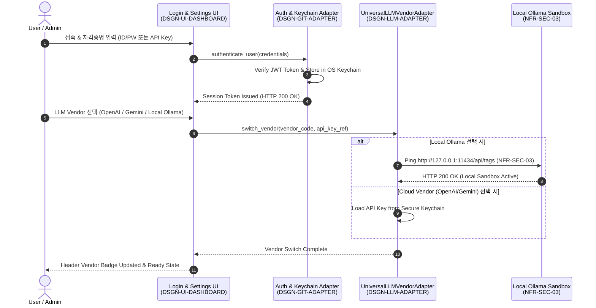
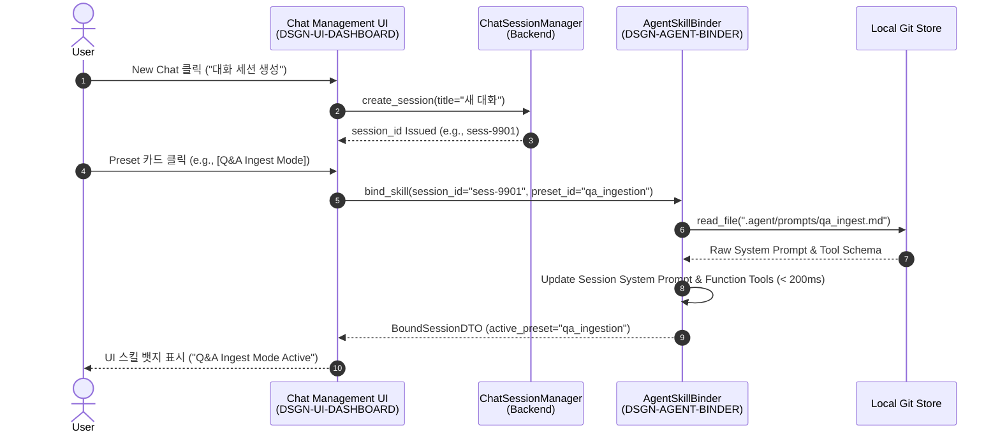
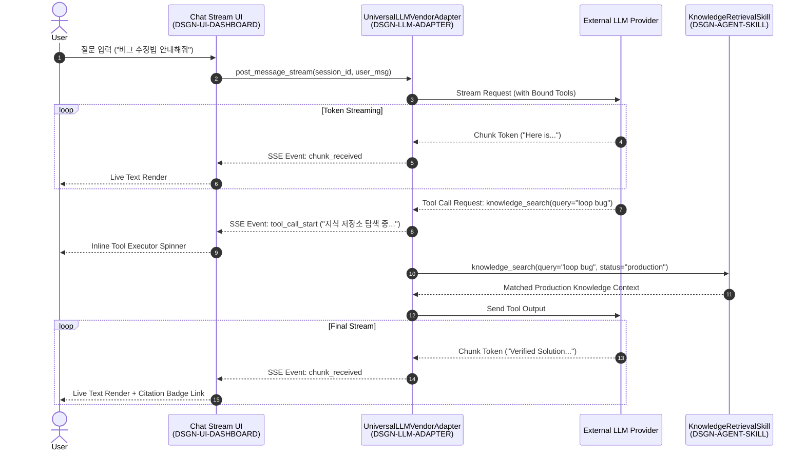
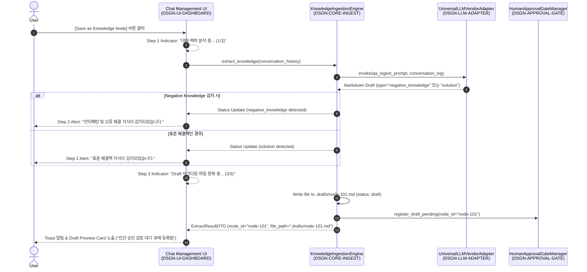

# 세분화 런타임 플로우 구현 계획서 (Detailed Runtime Flow Implementation Plan)

> **Document ID**: `0816_detailed_chat_and_auth_flow_plan`  
> **Date**: 2026-08-16  
> **Target Doc**: [.doc/0816_knowledge_platform_architecture_spec.md](file:///home/chaehwan/bifacewiki/bifacewiki/.doc/0816_knowledge_platform_architecture_spec.md)  
> **Related Skills**: [.skill/presentation_ui/SKILL.md](file:///home/chaehwan/bifacewiki/bifacewiki/.skill/presentation_ui/SKILL.md), [.skill/agent_binder/SKILL.md](file:///home/chaehwan/bifacewiki/bifacewiki/.skill/agent_binder/SKILL.md), [.skill/ingestion/SKILL.md](file:///home/chaehwan/bifacewiki/bifacewiki/.skill/ingestion/SKILL.md)  
> **Author**: Knowledge Platform Architecture & Dev Team  

---

## 1. Skill 추가 필요성 검토 결과 (Skill Addition Assessment)

### 1.1 기존 모듈/역할 스킬 현황 점검
현재 플랫폼에는 역할 기반 스킬 4종(`architect`, `po`, `developer`, `qa`)과 모듈 기능별 스킬 8종(`ingestion`, `indexer_dag`, `git_adapter`, `linter_engine`, `approval_gate`, `refactor_engine`, `agent_binder`, `presentation_ui`) 총 12종의 스킬이 정의되어 있습니다.

### 1.2 세분화 구현 요구사항과의 매핑
* **서비스 연결 (로그인/인증 포함)**: `presentation_ui` (UI 설정 레이어) + `agent_binder` (LLM Vendor API Key & Connection)
* **대화 관리 창 (세션/프리셋)**: `presentation_ui` (대화창 UI Widget) + `agent_binder` (`bind_skill` API)
* **결과 수신 (스트리밍/Tool Call)**: `agent_binder` (`UniversalLLMVendorAdapter` & `KnowledgeRetrievalSkill`) + `presentation_ui` (Inline Render)
* **지식 생성 중 단계 (Progress UX)**: `ingestion` (`KnowledgeIngestionEngine`) + `presentation_ui` (Draft Card Preview)

### 1.3 최종 판정
> **[결론] 별도의 신규 Skill 추가는 불필요함.**  
> 세분화 런타임 플로우는 신규 도메인이 아니라 기존 **`presentation_ui`**, **`agent_binder`**, **`ingestion`** 3개 모듈 스킬의 상호작용 인터페이스(Cross-Module Interaction)를 구체화하는 영역입니다. 따라서 신규 스킬 추가 없이, 기존 스킬의 인터페이스 명세를 준수하여 구현 계획을 수립합니다.

---

## 2. 세분화 구현 목표 및 범위 (Scope & Objectives)

1. **서비스 연결 & 인증 플로우 (Auth & Vendor Connection)**: 로그인, OS Keychain 연동, LLM Vendor 선택 및 Localhost Ollama Sandbox 헬스체크
2. **대화 관리 창 플로우 (Chat Session & Preset Binding)**: 대화 세션 생성/목록/전환, 원클릭 프리셋 스킬 바인딩 (< 200ms)
3. **결과 수신 & 스트리밍 플로우 (Streaming & Tool Calling)**: SSE/WebSocket 토큰 스트리밍, LLM Tool Call (`knowledge_search`) UI 캡처 및 결과 주입
4. **지식 생성 중 단계 UX 플로우 (Ingestion Progress & Draft Preview)**: 지식 저장 요청부터 Negative Knowledge 분류, Draft 카드 연동 및 승인 큐 등록 전 과정 UX 상태 변화

---

## 3. 세부 시퀀스 플로우 명세 (Detailed Runtime Sequence Flows)

### Flow 1: 서비스 연결 및 로그인/인증 핸드셰이크 (`Auth & Connection Flow`)

### Flow 2: 대화 관리 창 및 프리셋 바인딩 시퀀스 (`Chat Session & Preset Flow`)

### Flow 3: 결과 수신 및 스트리밍 시퀀스 (`Streaming & Tool Call Flow`)

### Flow 4: 지식 생성 중 UX 단계 시퀀스 (`Ingestion Progress Flow`)

---

## 4. API 및 UI 엔드포인트 세부 추가 규약

| 구분 | HTTP Method | Endpoint | 담당 모듈 | 설명 |
| :--- | :--- | :--- | :--- | :--- |
| **Auth** | `POST` | `/api/v1/auth/login` | `DSGN-GIT-ADAPTER` | 사용자 자격증명 검증 및 JWT 발급 |
| **Auth** | `GET` | `/api/v1/auth/session` | `DSGN-GIT-ADAPTER` | 현재 로그인 세션 상태 검증 |
| **Chat** | `POST` | `/api/v1/chat/sessions` | Backend Session | 신규 대화 세션 생성 |
| **Chat** | `GET` | `/api/v1/chat/sessions` | Backend Session | 대화 세션 목록 조회 |
| **Stream**| `POST` | `/api/v1/chat/completions/stream` | `DSGN-LLM-ADAPTER` | SSE 기반 LLM 토큰 및 Tool Call 스트리밍 수신 |
| **Ingest**| `POST` | `/api/v1/knowledge/extract` | `DSGN-CORE-INGEST` | Q&A 기반 Atomic Markdown 추출 및 Draft 저장 |

---

## 5. 구현 시퀀스 및 검증 계획 (Implementation Roadmap & Verification Plan)

### 5.1 구현 단계 (Implementation Phases)
1. **Phase 1 (Auth & Session)**: `POST /api/v1/auth/login` 및 `ChatSessionManager` 구축
2. **Phase 2 (Streaming & Tool SSE)**: `POST /api/v1/chat/completions/stream` SSE 엔드포인트 및 Inline Tool Event UI 처리 구현
3. **Phase 3 (Ingestion UX Progress)**: 3단계 Progress UI Indicator 및 Draft Preview 카드 연동
4. **Phase 4 (E2E Integration)**: 로그인부터 대화, SSE 수신, 원클릭 스킬 바인딩, 지식 저장 전 과정 통합 검증

### 5.2 자동화 테스트 (Automated Verification)
* `tests/test_auth_and_session.py`: 로그인 JWT 및 Keychain 연동 테스트
* `tests/test_chat_stream_and_tool_call.py`: SSE 토큰 스트리밍 및 Tool Call 캡처 테스트
* `tests/test_ingestion_progress_ux.py`: 지식 추출 3단계 런타임 응답 및 Draft 생성 검증

---

## 6. 결론 및 다음 단계 (Next Steps)
본 계획서(`0816_detailed_chat_and_auth_flow_plan.md`)는 서비스 연결, 대화 관리, 결과 스트리밍, 지식 생성 UX 런타임의 완전한 인터랙션 흐름을 명시하고 있습니다. 사용자 승인 후 이에 따라 TDD 개발 및 프론트엔드/백엔드 연동 작업을 진행합니다.
