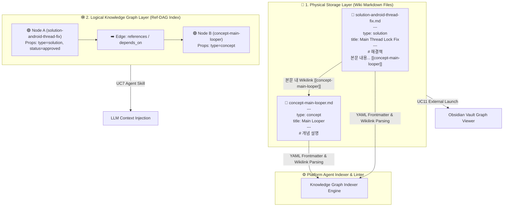

# Knowledge Graph & Wiki 문서 관계 설계 및 LLM 지식 생성 단순화 계획

## 1. 개요 (Overview)
본 문서는 **Knowledge Graph(Node & Edge)**와 **Wiki 문서(Markdown File)** 간의 대칭 구조 설계 및 복합 문서 문제 해결 방안, 그리고 **LLM의 지식 생성 부담을 극도로 단순화하는 3대 규칙 스펙**을 구체화하여 수립한 전용 기획 문서입니다.

---

## 2. Dual-Layer Architecture (물리-논리 이중 레이어 아키텍처)

지식 시스템은 **인간 친화적 평문 저장소**와 **AI/Agent 친화적 논리 그래프**의 2개 레이어로 분리 설계됩니다.



---

## 3. Node & Edge 상세 설계 스펙

### 3.1 Node (노드) 설계 및 복합 문서 해법
- **기본 구조 (Atomic Knowledge Page Pattern)**:
  - 거대한 통합 백과사전식 문서를 지양하고, **"1개 파일 = 1개 개념/해결책"**의 소형 원자적(Atomic) 마크다운 문서로 분할 생성합니다 (Karpathy LLM Wiki & Zettelkasten 기법).
  - 마크다운 파일 1개가 지식 그래프의 **Node 1개**로 1:1 대칭 매핑됩니다.
- **복합 문서 해법 (Sub-block Node Indexing)**:
  - 원자화되지 않은 긴 복합 문서가 존재하는 경우, 플랫폼 인덱서가 문서 내부의 **Heading (`# Section`, `## Subsection`) 및 Block ID (`^block-123`)**를 서브 노드(Child Sub-Node)로 논리적으로 가상 파싱하여 노드 그래프를 구축합니다.

### 3.2 Edge (엣지/관계) 추출 및 분류 스펙
엣지는 복잡한 그래프 DB에 저장되는 대신, Wiki 문서의 마크다운 표기법에서 **인덱서에 의해 자동 추출**됩니다.

| 엣지 종류 | 파싱 메커니즘 | 역할 및 예시 |
| :--- | :--- | :--- |
| **Explicit Edge (명시적 참조)** | 본문 내 `[[node-id]]` Wikilinks | 단순 참조/언급 관계 (`references`) |
| **Meta Edge (메타 관계)** | Frontmatter 내 `prerequisite`, `supersedes` | 선행 필요 지식 (`depends_on`), 지식 대체/쇄신 (`replaces`) |
| **Tag Edge (그룹 관계)** | Frontmatter 내 `tags: [android, thread]` | 동일 주제 노드 간 상호 연관 관계 (`same_category`) |
| **Semantic Edge (시맨틱 연관)** | 임베딩 벡터 시맨틱 유사도 (> 0.85) | LLM/Agent가 추론한 자동 연관 관계 (`semantically_related`) |

---

## 4. LLM 지식 생성 규칙 3가지 단순화 스펙 (Simple Ingestion Protocol)

LLM에게 복잡한 UUID, 태그 메타, 엣지 그래프 구조 입력을 강요하면 생성 실패율과 환각이 높아집니다. 따라서 LLM에게는 **단 3가지의 극도로 단순한 규칙만 부여**하고, 메타데이터 보완은 **Platform Agent 백엔드가 자동 처리**합니다.

```
┌────────────────────────────────────────────────────────────────────────┐
│ 🤖 LLM 지식 생성 3대 단순 규칙 (Simple Ingestion Protocol)             │
├────────────────────────────────────────────────────────────────────────┤
│ [Rule 1] Minimal Frontmatter : type과 title 2개 헤더만 작성할 것        │
│ [Rule 2] Simple Wikilinks    : 타 용어 참조 시 단순 [[지식명]] 만 적을 것 │
│ [Rule 3] Single Topic Focus  : 파일 1개당 1개 주제만 담고 분리할 것     │
└────────────────────────────────────────────────────────────────────────┘
```

### 4.1 LLM 출력 마크다운 규격 예시
```markdown
---
type: solution
title: Android Main Thread Lock 해법
---

# Android Main Thread Lock 해법

Main UI Thread에서 동기 대기 시 ANR이 발생하므로 [[Android Main Looper]]를 블로킹하지 마십시오.

## 올바른 대안
[[RxJava Async]] 또는 [[Kotlin Coroutine]]을 사용하여 비동기로 전환해야 합니다.
```

### 4.2 Platform Agent & Linter의 백엔드 자동 보완 역할
- **`id` 및 시스템 메타 자동 생성**: 파일명 기반 고유 ID, `created_at`, `author: agent`, `status: draft` 자동 부여
- **Graph Edge 파싱**: `[[Android Main Looper]]`, `[[Kotlin Coroutine]]` Wikilinks를 자동 탐지하여 지식 그래프 인덱스 업데이트
- **Linting (UC8)**: 존재하지 않는 지식 노드 참조 시 깨진 링크(Broken Wikilink)로 탐지하여 UI 승인 큐에 알림

---

## 5. 외부 지식 툴 (Obsidian / Logseq) 연동 구조 (UC11)

- **자체 구현 배제**: 복잡한 2D/3D Force Graph 엔진을 직접 개발하지 않음.
- **표준 호환성**: 모든 데이터가 마크다운 표준 규칙(`Markdown + Frontmatter + Wikilinks`)을 따르므로 외부 PKM 툴과 100% 호환됨.
- **원클릭 실행 UX**: Knowledge Platform UI 내 **`[Open Graph in Obsidian ↗]`** 버튼 클릭 시, 등록된 Obsidian 툴이 실행되어 해당 저장소가 Obsidian Vault로 원클릭 로딩 및 지식 그래프 시각화 탐색 수행.

---

## 6. 향후 세부 추진 로드맵
1. **[Step 1] YAML Frontmatter 표준 스키마 명세 작성**: `type`별 필드 규격 및 Linter 검증 규칙 정의
2. **[Step 2] Agent Ingestion Prompt 템플릿 제작**: 3대 단순화 규칙이 적용된 LLM 지식 정제 프롬프트 파일(`.agent/prompts/qa_ingest.md`) 생성
3. **[Step 3] Graph Indexer & Linter 파서 엔진 구현**: Wikilinks 추출 및 Ref-DAG 메모리 인덱서 구현
