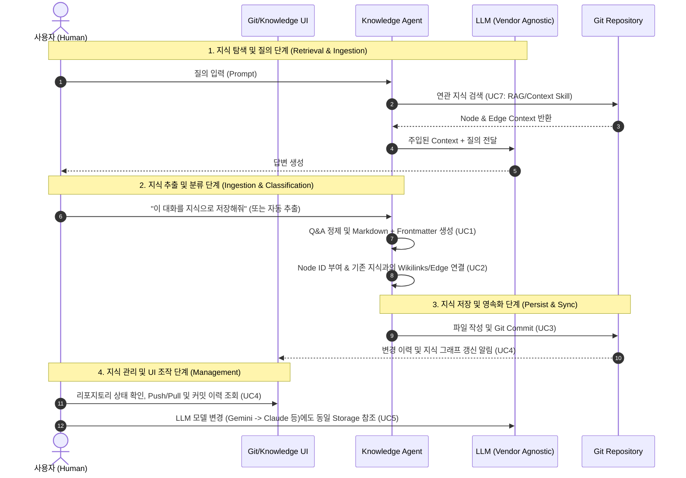
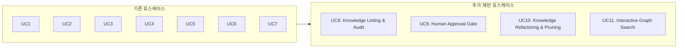

# Knowledge Framework Use Cases (분석, 플로우, 누락 UC 리뷰)

## 1. 개요 (Overview)
본 문서는 정의된 7가지 유스케이스(UC1~UC7)를 심층 분석하고, 전체 시스템의 End-to-End Flow(운영 흐름)를 예상하며, 실전 지식 거버넌스 관점에서 **누락된 유스케이스(Missing Use Cases)**를 리뷰하고 보강된 아키텍처를 제안합니다.

---

## 2. 기존 유스케이스 심층 분석 (UC1 ~ UC7 Review)

| UC ID | 유스케이스 명칭 | 주체 (Actor) | 핵심 역할 및 가치 | 비고 |
| :--- | :--- | :--- | :--- | :--- |
| **UC1** | Q&A 지식 추출 및 저장 | User, LLM | 질문-답변 중 유의미한 가치(성공적인 해결책 뿐만 아니라 **시도했으나 실패한 / 하지 말아야 할 동작(Negative Knowledge)** 포함)를 추출해 지식화 | 데이터 수집 관문 |
| **UC2** | Node & Edge 체계적 분류 | Platform Agent | 지식을 단일 텍스트가 아닌 관계형 그래프(Wikilinks, Ref-DAG)로 세분화 | 지식 구조화 |
| **UC3** | Git Repository 저장 및 관리 편의성 | Storage | 별도 DB 구축 없이 Git 생태계를 활용하여 지식 저장, 이력 추적, Diff 비교, 롤백, 브랜치/백업 관리의 편의성 제공 | 저장소 관리 편의성 |
| **UC4** | Git 생성 및 관리를 위한 UI 제공 | Human User | Git CLI 명령어 없이도 버튼 클릭과 대시보드를 통해 Git 저장소 생성, 동기화(Push/Pull), 상태 관리가 가능한 GUI 제공 | 사용자 조작 편의성 |
| **UC5** | 지식 유지 | Architecture | LLM 공급자(OpenAI, Gemini, Local) 변경에도 단일 지식 창구 유지 | 독립성 & 확장성 |
| **UC6** | Platform Agent Skill & Prompt 원클릭 주입 UI 제공 | Agent, User | 수동 복사/붙여넣기 없이 UI 클릭 몇 번으로 프롬프트/스킬 프리셋을 LLM 런타임 환경에 즉시 자동 주입 및 실행 | 원클릭 프롬프트/스킬 바인딩 |
| **UC7** | Agent/Skill을 통한 LLM 지식 제공 | Agent, LLM | 축적된 Knowledge를 고정된 RAG가 아닌 Knowledge Agent가 제공하는 Skill(Search, Retrieve, Context Inject 등)을 통해 LLM에게 동적으로 전달 및 주입 | Agent/Skill 기반 지식 제공 |

> [!NOTE]
> **💡 UC1 지식 가치 분류에서의 "Negative Knowledge (하지 말아야 할 동작)" 포함 여부**
> - **당연히 포함됩니다.** 단순 성공 사례(Solutions)뿐만 아니라 **"시도해 보았으나 실패한 접근법, 데드락/오류를 유발하는 하지 말아야 할 동작(Anti-Patterns, Pitfalls, Negative Constraints)"**은 지식 자산에서 가장 가치 높은 지식 중 하나입니다.
> - **구현 방식**: UC2 스키마 분류 시 `type: negative_knowledge` 메타데이터 속성을 부여하여 일반 지식 노드와 명확히 구분합니다.

> [!NOTE]
> **💡 Knowledge Graph & Wiki 문서 간 설계: 복합 문서 해법 및 LLM 단순 생성 규칙 3가지**
> - **1. 복합 문서 해법 (Atomic Knowledge Pattern)**:
>   - Wiki 문서는 복합적이므로 거대한 통합 문서 대신 **"하나의 개념/해결책당 하나의 소형 원자적(Atomic) Markdown 파일"**로 분할하여 작성하도록 LLM을 가이드합니다 (Zettelkasten & Karpathy Wiki 패턴).
>   - 긴 복합 문서의 경우, 문서 내 Heading(`#`) 또는 Block ID가 서브 노드(Child Node)로 논리 매핑됩니다.
> - **2. LLM 지식 생성 규칙 3가지 단순화 (Simple Ingestion Rules)**:
>   - **규칙 1 (Minimal Frontmatter)**: `type`과 `title` 2가지 최소 헤더만 요구 (복잡한 메타는 Linter가 자동 보완).
>   - **규칙 2 (Simple Wikilinks)**: 본문 내 연관 지식은 단순 `[[지식명]]` 표기만 사용.
>   - **규칙 3 (Single Topic)**: 파일 하나당 단 하나의 핵심 주제만 담고, 길어지면 새로운 `[[연관지식]]` 파일로 분리.

> [!NOTE]
> **💡 UC6 프롬프트(Prompt) 관리 및 UI 원클릭 주입 방식 (One-Click Injection UI)**
> - **관리 위치**: Git 지식 저장소 내의 **`.agent/prompts/`** 및 각 Skill 정의 파일(`SKILL.md`)에 저장되며 Git으로 버전 관리(UC3)됩니다.
> - **원클릭 UI 바인딩**: 사용자가 긴 프롬프트를 수동으로 복사-붙여넣기 할 필요가 없습니다. UI 상에서 **[Q&A Ingest Mode]**, **[Linting Mode]**, **[Graph Refactoring Mode]** 등의 프롬프트/스킬 프로필을 클릭 한번으로 활성화하면, Platform Agent가 해당 템플릿과 Tool 규약을 LLM 세션에 즉시 자동으로 바인딩/주입합니다.

> [!NOTE]
> **💡 UC7 Agent/Skill 기반 LLM 지식 제공 메커니즘 (Knowledge via Agent/Skill)**
> - **제공 방식**: 단순 외부 RAG 파이프라인으로 텍스트를 붙여넣는 것이 아니라, **Knowledge Platform Agent가 제공하는 표준 Skill(예: `knowledge_search`, `knowledge_retrieve`, `knowledge_context_inject`)을 매개로 실행**됩니다.
> - **장점**: LLM이 필요한 시점에 스스로 Skill을 호출하여 정밀한 지식을 가져오거나(Tool-Calling Agent), Agent가 질의 맥락에 따라 스킬을 통해 최적 노드/엣지 조합을 동적으로 LLM Context Window에 주입(Context-Injection Skill)할 수 있습니다.

> [!NOTE]
> **💡 UC8 & UC9 Linting / Approval UI 설계 아키텍처 가이드 (대화 일관성 보존)**
> - **결론**: **"별도 전용 거버넌스 UI(대시보드) + 대화창 위젯 카드"의 하이브리드 분리 구조**를 권장합니다.
> - **LLM 텍스트 프롬프트로 다 처리하지 않는 이유**: 승인/알림 텍스트를 LLM 대화 상에 섞으면 대화 흐름(Chat Flow)이 린트 보고서와 승인 텍스트로 오염되어 일관성이 깨집니다.
> - **추천 UX 아키텍처**:
>   1. **기능적 관문 (별도 UI)**: UC4 Git UI 내 `[지식 승인 & Audit 대시보드]`를 두어 GitHub PR 승인 UX처럼 Diff 확인 및 One-click 승인 처리.
>   2. **대화 인터랙션 (대화창 UI)**: 대화 중 발생한 Ingest/Lint 결과는 LLM 텍스트가 아닌 대화창 하단의 **경량 위젯 카드(Rich Widget Component)**로 노출하여 대화 몰입도 유지.

---

## 3. 예상 통합 실행 플로우 (Expected End-to-End Workflow)

지식이 생성되고, 검증·저장되어 다시 LLM의 지식으로 환류되는 **전체 지식 수명주기(Lifecycle Flow)**는 다음과 같습니다.

### 3.1 Flow 시퀀스 (Mermaid Sequence Diagram)

---

## 4. 누락된 유스케이스 분석 및 추가 제안 (Gap Analysis)

기존 UC1~UC7은 **"지식의 저장-분류-저장소 제어-LLM 주입"**에는 충실하지만, 지식을 **"지속적으로 신뢰할 수 있게 유지하고 관리하는 거버넌스(Governance) 및 인간 참여(Human-in-the-Loop)"** 측면에서 다음과 같은 핵심 유스케이스가 누락되어 있습니다.

### 🔴 누락된 핵심 유스케이스 4가지 제안

#### 1. UC8. 지식 정합성 검사 및 자동 린팅 (Knowledge Linting & Audit)
- **부재 시 문제점**: AI가 잘못된 Q&A를 지식으로 저장하거나 깨진 참조(Broken Edge), 고립된 노드(Orphan Node), 상충되는 지식(Contradiction)이 발생할 때 검증 메커니즘이 없음 (*Model Collapse 및 환각 재귀 발생 위험*).
- **정의**: 주기적으로 또는 지식 저장 시 **지식 린터(Knowledge Linter)**가 동작하여 깨진 Wikilinks, 스키마 미준수, 고립 노드, 지식 간 모순을 자동 탐지하고 리포트를 생성.

#### 2. UC9. 인간 검증 및 승인 관문 (Human Approval & Knowledge Brokerage)
- **부재 시 문제점**: LLM이 생성한 지식이 검증 없이 바로 Git에 저장되어 Source of Truth를 오염시킬 수 있음. (Human Knowledge와 AI Knowledge 경계 모호)
- **정의**: LLM이 정제한 지식 노드를 바로 저장소의 `main` 브랜치에 직접 저장하지 않고, Draft 상태로 생성 후 **인간 중개자(Knowledge Broker)**가 검토/승인(Approve)하거나 PR(Pull Request) 형태로 병합하도록 제어.

#### 3. UC10. 지식 병합 및 폐기 수명주기 관리 (Knowledge Refactoring & Pruning)
- **부재 시 문제점**: 시간의 흐름에 따라 동일/유사한 중복 Q&A 지식이 파편화되어 축적되거나, 더 이상 유효하지 않은 옛 지식이 지속적으로 검색되어 성능 저하 유발.
- **정의**: 중복 노드 통합(Merge), 오래되었거나 오답으로 판명된 지식의 폐기(Deprecation/Archive) 및 수명주기(Lifecycle) 관리 기능.

#### 4. UC11. 외부 그래프 뷰어 툴 연동 및 등록 (External Graph Viewer Tool Integration)
- **개념**: 2D/3D 그래프 뷰어를 자체 구현하지 않고, Obsidian, Logseq 등 전문 외부 지식 툴을 등록하여 저장소 디렉토리를 연동.
- **정의**: UI 상에서 외부 그래프 툴(Obsidian 등)의 경로/Vault를 등록하고, `[Open Graph in Obsidian]` 원클릭 버튼을 통해 지식 그래프 시각화 및 탐색을 외부 툴에 전담시킴.

---

## 5. 종합 확정 유스케이스 매트릭스 (UC1 ~ UC11)

| 구분 | UC ID | 유스케이스 명칭 | 핵심 기능 |
| :--- | :--- | :--- | :--- |
| **Ingestion** | **UC1** | Q&A 지식 추출 및 저장 | 질문-답변 대화에서 지식 노드 자동/수동 정제 |
| **Structure** | **UC2** | Node & Edge 체계적 분류 | Markdown + Frontmatter, Wikilinks 기반 그래프화 |
| **Storage** | **UC3** | Git Repository 저장 및 관리 편의성 | 별도 DB 없이 Git 기반 지식 저장, 이력 추적, Diff/롤백, 브랜치 관리 편의성 |
| **Management**| **UC4** | Git 생성 및 관리를 위한 UI 제공 | CLI 없이 UI 버튼/대시보드로 Git 저장소 생성, Sync(Push/Pull), 상태 관리 |
| **Platform** | **UC5** | Vendor-Agnostic 지식 유지 | LLM 서비스 변경에 독립적인 단일지식 창구 보장 |
| **Agent** | **UC6** | Skill & Prompt 원클릭 주입 UI | 수동 입력 없이 UI 클릭 한번으로 프롬프트/Skill 프리셋을 LLM 런타임에 바인딩 |
| **Retrieval** | **UC7** | Agent/Skill 기반 LLM 지식 제공 | 하드코딩 없이 Agent가 제공하는 Skill(Search, Retrieve, Context Inject)을 통해 동적 주입 |
| **Governance**| **UC8** | 지식 정합성 검사 (Linting) | 깨진 참조, 모순, 스키마 오류 자동 감지 [신규] |
| **Approval** | **UC9** | 인간 검증 및 승인 관문 | Human Broker 승인 프로세스 (Draft -> Main) [신규] |
| **Lifecycle** | **UC10** | 지식 병합 및 폐기 (Refactoring)| 중복 노드 통합 및 낡은 지식 Pruning/Archive [신규] |
| **Explore** | **UC11** | 외부 그래프 뷰어 툴 연동 | Obsidian/Logseq 등 외부 전문 툴 등록 및 원클릭 연동 실행 [신규] |

---

## 6. 향후 구현 로드맵 (Execution Plan)
1. **[Step 1] 문서 갱신 확정**: `.doc` 내 최종 거버넌스 및 유스케이스 정의서 동기화
2. **[Step 2] 스키마 & 프로토콜 규격 작성**: Node (YAML Frontmatter) 스키마 및 Agent Skill (MCP/Tool) 명세서 정의
3. **[Step 3] 핵심 엔진 & UI 프로토타입 구현**: Git 연동 Subsystem, Linter Engine, 웹 UI(Git Sync & Graph Visualizer) 설계 및 구현
